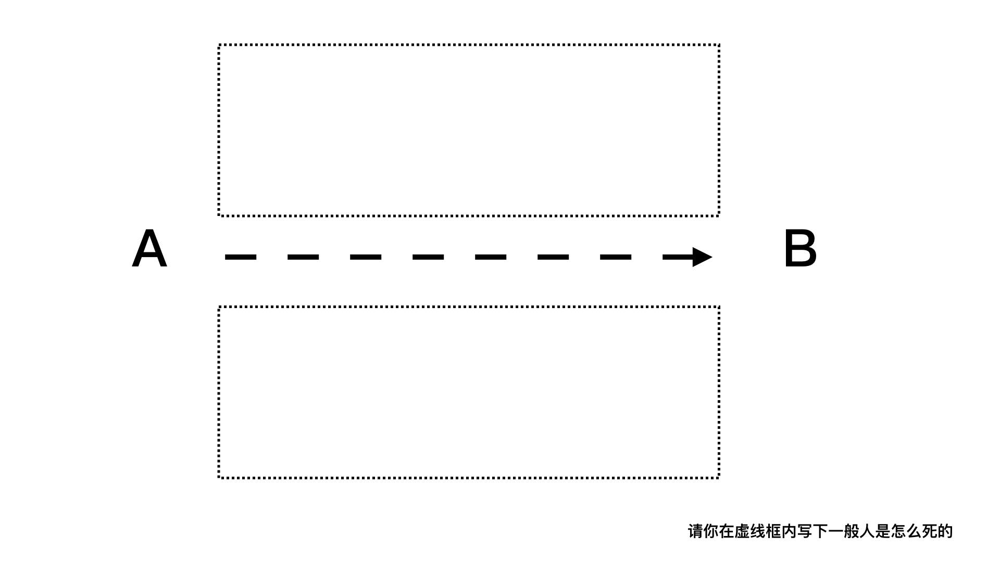
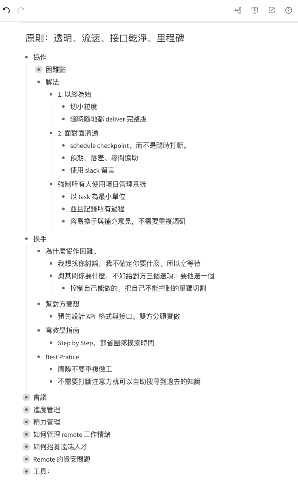

# 大部分解

要能够能流畅写作。我认为最关键的第一件事，就是确定写作目标。

这句话听起来像是废话一样。但这却是却在写书界里面成为出版社与作者共同的痛苦。

在写这本书时，我曾经作了一个小 Polling。

调查一些签约以后却便秘的作者在写作时，遇到最大的痛苦是什么。

意外与不意外的是，写书当中大家最大的痛苦是：

* 材料太多
* 重复修整，修整不完

这一点一般读者可能很意外。原来写书的人，不是没有灵感，反而是材料太多写不完、修不完？

但是这一点我却不是很意外。因为我就是这么过来的。

各位别看，我现在随便信手拈来就能写一本书。当我自己在写头几本书时，却真的都遇到过这样的问题。

「前言真的超难写。光前言就重写了好几遍。再来，自己只有能量一口气写　1\~3 章。但是不知道为啥，每次打开编辑器，永远却都在重构 1-3　章。怎么写都不满意，很崩溃。很想找个大假期好好把整本书 10　章一口气写完。却永远排不出时间。」

当我这样叙述，我最初开始写书的经历时。我那些被出版社追杀的作者朋友，彷佛觉得我有猜心术一样。

其实，不是我懂猜心。而是每个「首次作者」都这样崩溃过来的。

我虽然熟悉写作，但在最之前，功力拿来写写几本小题目的技术书还行。但是，如果是那种 80000
字的正式主题纸质书时，我也跟大家一样，刚动笔三章就放弃就开始鬼打墙放弃。

后来，我怎么脱离这样的困境呢？

也是我比较执著。总觉得写作这行，一口气只能写几千字不科学。我写网站时，写代码能够一口气写上几千几万行。把自己关起来瞎整两个礼拜。再痛苦也能写出个商业项目来。没道理在写作这个领域踢到铁板。

于是，我进行了最笨的一个实验：花了一年多时间，写了好几本书。把写书框架整出来。

## 第一步：确定这本书的读者是谁

写书最重要的第一件事，就是确定读者。这件事非常基本，但是几乎很少「首次作者」做得好。

我知道许多想写书的作者。写书的目标是想要造福越多人越好。

所以，很多「首次作者」的写作目标是「所有人」。 --- 这也是种下「写不完」结果的「第一个原因」。

而第二个原因是，如果问这些「首次作者」，它们期待读者看完书之后，读者会得到什么能力。

这些「首次作者」，会回答：「变得跟我一样」。

所以综合一下，它们的写作目标是：写一本「给所有人看完就会变得跟作者一样大师水平」的书。

不要笑。读者看到这里应该很想笑。

但是不盖你，所有陷入写不完地狱的作者。它们之所以永远陷在鬼打墙永远在修稿的原因，就
是因为它们想写一本「给所有人看完就会变得跟作者一样大师水平」的书。所以才会永远卡在前三章写不完.....

所以才会出现这这样的情形。

一直加料一直修改，加到最后写不完、改不完。因为无论写到哪里自己都觉得自己写到一半歪楼了。想重写。

而这也是出版社编辑最头大的地方。出版社在跟「首次作者」签约以后的第一个会议，往往是请作者先设定这本书的目标读者。然后就会出现「所有人」这个答案。而不管编辑如何怎么道德劝说，作者还是会热血博爱的不改其志。

＝＝＝＝ 花絮

这本极速写作的书，本来不在我的出版计画。但是当编辑看过我的写作法教学视频之后。发现这个视频的内容竟然全是它们多年以来重复跟作者提醒的总和解答篇。

而且也包含了它们最头痛的鬼打墙篇，于是就兴奋的说要签下这本书。

这样以后签约不必再跟不同的作者重复叮咛。只要扔这本书给它们就行了。

＝＝＝＝

我认为，编辑不应该这样问作者。而应该将问题修改成：「你期望读者，在看完这本书之后，有什么样的状态改变？」

因为，即时编辑不管怎样道德劝说。你是无法改变作者的大爱「想要写给所有人」的这件事。那还不如改变角度，劝说作者普通人能力有限。看完这本书应该设定一个明确能达到的能力上限。

这里第一步，就是先列一个 A 点。A 点是一个白纸状态。而 B 点，是作者认为作为你的学徒，应该要达成的具体能力。（B 点绝对不可以是作者现在的功力）

而第二步，是把一般人从 A 点走到 B 点的困难列下来。

第三步是，将这些问题反向列出来解法。并且归类。

我举我过去几本书的例子。你就知道我是怎么写的了。

### 书例：闪电式开发

比如我的「闪电式开发」，是写给只会写代码的程序员看的。这些程序员很羡慕我能够创业成功。在创业期间它们会遇到的困难，这当中任何一个困难，就会害它们死掉了：

* 不知道做哪个 IDEA 比较好？
* 不知道那个 IDEA 会赚钱？
* 莫名其妙踩到一些小坑就死了
* 做完产品以后却错过风口了
* 找到黄金团队，开发速度却龟速如牛
* 产品上线后却没有人会用
* 产品上线以后发现要打掉重做
* 产品上线两次改版以后没钱黄了
* 产品上线以后赚不到钱
* 产品上线以后用户无法增长

所以具体来说反过来，我可以写的题目是

* 如何鉴定哪一些是可以做的 IDEA
* 哪一些是可以赚钱的 IDEA
* 创业路上常见的小错，但是犯了就会挂掉
* 如何抢在风口上线
* 如何快速开发可行性产品
* 如何开发出上线就有人要用的产品
* 如何开发出上线就有人要用的产品
* 如何上线两周之内就能找到正确改进的方向
* 如何上线后能够持续赚钱
* 如何上线后能够持续增长

然后整理出来。我就有了 3-4 个具体关键字 Section 了。分别是

* IDEA 篇
* 协作篇
* 打磨篇
* 增长篇

### 书例：打造超人大脑

这本书是写给想要增长自己的能力的「所有人」。是写给困在原地无法成长的青年看的。我希望它们看完以后能够运用一些简单的技巧与概念打破增长天花板。那么，它们平时会遇到什么困难呢？

* 看书慢
* 学东西速度慢
* 学东西容易忘记
* 写文章慢
* 企划能力低落，遇到事情容易卡关
* 容易对事情三分钟热度
* 容易不幸运
* 觉得学新事物费劲

所以具体来说反过来，我可以写的题目是

* 普通人如何拥有快速阅读能力
* 如何可以快速上手一门学问
* 如何学完东西以后不容易忘记
* 如何容易写出一篇文章
* 如何破解眼前的难题，不容易被卡住
* 如何设计一套机制，让自己不容易三分钟热度
* 如何找到自己的幸运公式
* 如何破解学新事物的心魔

然后整理下来。本来我在写这本书的时候，觉得只会有两个关键字而已。

* 输入
* 输出

没想到新增了一个：

* 持续成长

### 书例：远距工作这样做

这本书是我最近出的新书。讲远距工作的。目标读者是原本不熟远距的工作者，希望它们读了这本书后，可以改善效率问题。它们的问题有：

* 远距后、沟通很费劲
* 工作换手交接很困难
* 开会非常占据精力
* 工作进度满天飞，没人能确切掌握小组进度
* 在家工作功效效率低下
* 远程沟通时，工作气氛不良
* 担心远程文件，传递时机密泄漏

这个领域会发生的问题属于比较杂的问题。但其实还是可以归类成两组问题：

* 沟通问题
* 其他问题

## 第二步：打出这本书的主架构

为什么我们要做这样的一道打架构的动作呢？其实这是因为写书实在是相对一道漫长以及耗费精力的过程。作者们会写到绝望，往往是鬼打墙，觉得自己看不到终点。

用这个方法。作者就会有比较明确的写作目标。就算是跑马拉松，你也得知道起点、终点在哪吧。

用这个方法，你不仅可以知道起点与终点在哪里。并且知道跑这一段马拉松，会经过哪些不一样的地形，如何配速跑过这些地形。

一般来说。一本200-300 页的完稿字数约在 80000 字上下。然后出版社接收的第一稿约 60000 字。所以分到 3 个 Section，一个 Section 就是两万字，一个 Section 四篇文章，一篇文章就是 5000
字。如果分到 4 个 Section，一个 Section 就是 15000字，一个 Section 三篇文章，一篇文章也是 5000 字。

所以算一下，就是写 12 篇文章，每篇 5000 字。这样下来看起来有没有容易一些了。

然后，找到了这个 Section 后。我就会开始在这个 Section 下。草拟一下我可能想要写的主题。再排定优先权。

因为每么章节，一定有需要优先写的题目，一定有相对枝微末节的题目。

比如在 \<\<闪电式开发\>\> 这本书里面的 IDEA 篇。

我可能可以写的题目就有：

* 如何鉴定哪一些是可以做的 IDEA
* 哪一些是可以赚钱的 IDEA
* 创业路上常见的小错，但是犯了就会挂掉
* 如何做出成功的第一版 IDEA

但是其实这些题目是有优先级顺序的。比如说我自己觉得不是有 IDEA 就好。不会赚钱的没用。所以创业第一件事就是要找出什么 IDEA 才能赚钱，并且实验成功。第二件事情是确保 IDEA 的方向是小而正确的，而且要在没上市前就猜对。第三件事情才是不要踩到那些地雷，莫名其妙的挂掉。

所以最后这个 Section 我的三篇文章就是

* 1 如何低成本测试 IDEA
* 2 如何在实做前就找到正确方向
* 3 RD 创业遇到的九九个坑

这个阶段，我通常会用纸把灵感写下来。然后用笔圈出优先权。

### 书例：如何打破程序员天花板

这是一本我曾经想写的书，在这里用来作为例子。我的目标读者是一个懵懂刚入门的程序员。期待他看完的状态，是一个知道自己职业生涯快乐财务自由的程序员。

所以 A -\> B 是这样设计的。

然后我找到了想要写的一些题目，发现可以归类成三个 Section。这三个 Section
是以程序员的成长周期划分的。

当我可以划分出来之后。皆下来我会对每个阶段进行整理与 Prioritize。

比如：程序员在第一阶段摸索期。第一份工作的选择应该是最重要的。如何大量的吸收经验，去决定未来自己想要往哪个方向，并且找到资源。

比如：程序员在第二个阶段上升期，则是要著重锻炼自己的协作能力，以及打磨自我精进技巧。

比如：在程序员最后的成熟期，会迈入不再跟人拼体力青春。而是拼综合技能的阶段。这个阶段需要养成管理能力以及商业 sense。

每本书，虽然不一定会切出三个
Section。但是其实整个归类一遍，你会发现我们还是有机会讲主题分群了。而一旦分群，就更能细致的选择优先要谈的主题以及次要主题。

## 第三步：从自己最擅长的主题开始写

终于要开始进入到写作环节了。用这个方法，除了不仅可以很快构筑出一个安全写作边界之外。更大的好处就是可以从自己最擅长的主题开始写。

一些「首次」作者对于写书，有一些误解。比如：

* 以为写书要从「前言」开始写
* 以为写书要按照顺序开始写
* 以为写书是需要一口气写完
* 以为书的内容必须越多越好
* 以为每一章的内容需要平均份量

这些其实都是误解。

我也是写到第二本第三本才知道一些技巧：

* 原来一本书的「前言」，通常是最后写的
* 我们看到出版的书，其实最少经过四次校订。很多时候，读者甚至是在写完整本书之后，再把每一章大砍重修，才接成最后完美的模样。
* 写不出长文没有关系。最后编辑在编辑会议时，会指导作者怎么样「灌」内容。

但是「首次」作者并不知道。

所以绝大多数的作者，在写自己头一本书时，总会掉入这样的死循环：光前言写很多次，1\~3
章也重写很多次。从入门到放弃。

连编辑自己都劝不动作者。所以，我的编辑才会觉得我能够写这本书，实在是太救世了。

让可以跳出「写作」的框框这样想吧。写作可以好比是在拍一支影片。既然是拍影片，正常人都会觉得「一镜到底」是难度非常高的事吧。所以正常拍片团队，都是写好分镜稿、拍上大量的
A-Roll、B-Roll，再后制剪辑而成。

其实写书也应该如此。

再来，这书里面肯定是有一些章节，是自己擅长写，打开就文思泉涌。有一些章节，只是自己略有涉猎而已。

那么为什么不先写那些容易文思泉涌的呢？

## 如何「人造」出「文思泉涌」？

说到文思泉涌。很多人都认为「灵感」这件事，是可遇不可求的。

在几年前，我也很常思考，如何人造出「灵感」这件事。

我的第一本书，不是我「写」出来的

老实说，我第一次出版纸书「Growth Hack
这样作」时，那本书并不算是「我自己写出来的」。

当时出书的过程是这样的。我在 2015 年曾经开了一堂很红的 Growth Hack
增长课，当时这堂在台湾，非常的红。几乎班班爆满。一年之内，我开了 17 梯次
增长课。这个题目我讲到有点疲倦，有一点不是很想要继续开下去。

当时我的编辑 Esor 觉得这应该是一本适合做成书的内容，所以希望我出这本书。

后来，书是签了下来。但是我却一直写不出来。很奇怪的，这本书的题目我「讲」起来头头是道，但是在写书时，一直写不完。一样的，我也是老是被困在「前言」与「1\~3章」，不断的重写。

后来眼看出书的期限一直在逼近。最后逼不得已，我只好使出了一个大绝招：因为我的课，每堂都有录影。我就在思考，不知道是不是可以这样。我请人把录影档
dump 出逐字稿。因为课程里面有十章，几乎都是分段好的。

我再花了整整两个礼拜的时间，把这十章的逐字稿，重写一遍。最后 Esor
再帮我重新剪辑润饰，最后才成了大家眼前的这本书。

这件事说起来也挺丢脸的。我第一本书，不是我「写」出来的。而是我「讲」出来的。

### 「直播」写书

但是基于那次写书的经历。我发现一件事。为什么我讲话经常可以滔滔不绝、不加思索。但是当我要写个什么文章，除非当场是「满满灵感」，我却连区区五百字都写不个出什么毛来。

但是不管了。既然发现这个大杀招。就要好好的大用特用。

所以，后来我的第二本书。有一部份就是类似的方法，写出来的。

只要我想写一个比较长的主题。这个主题我自己粗估都可能要1-20000字才讲的清楚。

我就会开直播。然后在直播时解释这个概念。

用直播写书有一个好处。就是人类讲话是打字的大概3-6倍快。所以，我做半个小时的直播，逐字稿、就有10000字。1小时的逐字稿、就有
20000 字。

所以，后来我会很习惯，想要讲什么比较长的主题时，就开直播讲。讲完再转逐字稿。然后再「剪辑」「重写」逐字稿。

这样的写作方式，让我后来的创作过程变的轻松不少。

所以在「闪电式开发」这本书写作时，里面不少的「创业故事」，其实是我一口气开直播将「故事」一口气都讲完，再重新剪进去的。如果不是用这个方法，我根本写不出来那么多东西。

### 为什么是「直播」而不是「录影片」？

写到这里，有读者可能很好奇，为什么要「直播」而不是「录影」？两者有什么区别吗？

我认为有很大区别。

我之所以选择用直播的原因，是因为有观众。其实我不太在乎有多少人实际参与了「直播」，而是镜头对面「有人」这件事，就能促使我再讲述时，会有想要把「概念」「讲清楚」的动力。

如果是直接拍空无一人影片。我可能就只是比较想将分镜稿「表演」完而已。

所以，这才是为什么我写作时，坚持开「直播」。因为「对著一群人」解释概念时，真的比较容易无意之间脱稿而出，讲出一些在大纲稿上意想不到的「比方」。

「直播」写稿，不是更花时间吗？

读者看到这里会有一点纳闷。天阿。直播。直播不是比写书更难吗？我有直播恐惧症。

直播不是要写逐字稿吗？怎么会比较轻松呢？

老实说，我第一次做直播前，也是这样想的！我第一次做直播时，是大概在中国做「全栈营」的时候。那时候连续 6 个月，我每一周都要做「直播」。

我哪可能那么高产。每周都要写逐字稿。早累死了。

其实，逐字稿这个点子，我还真不是没试过。只是很快就放弃了。我第一次做直播时，的确有在公司内先内测，就是先用逐字稿打稿、背稿，结果发现效果差。

我发现主要是真没办法看著逐字稿上节目。会一直吃螺丝、忘记自己要说什么、注意力都在稿上，而不是镜头上。就算勉强讲也没有什么感情。状态很糟

后来我退一步求其次。上节目前写逐段稿。比如说直播可能是 30 分钟。可能段落有个 15-20 段。我在打稿时，只在 A4 纸上腾下每一段大概要讲的概念。可能就一句话，其馀自由发挥。

改用逐段稿后，果然上直播讲话就顺畅太多了。不但不会吃螺丝，排练时也能清楚的记得这些段落的顺序。在内测时讲歪了，在纸上重构内容顺序也方便（在纸上改段落只要打叉重写就好了）。

所以做一份直播稿的速度变得非常快。

我只要认真坐著用笔在纸上写10-15分钟。然后在空气中练习只按照段落脑子过2-3遍顺序。就可以讲得很流利了。

上直播时，其实我的桌子上也摆著这些直播提词稿，不过上面就只有关键字，忘记内容时只要瞄一眼就能继续讲下去。

所以，后来我创作内容，就喜欢做「直播」。

因为改成用「直播」写作，比以前直接硬写稿快太多。

## 为什么你不应该用「写」的去「写书」？

后来，我因为研究教育的关系，接触到「认知心里学」，开始了解大脑的运作原理以后。才发现为什么我们「写作」时，为什么那么费劲。

原因是，我们在「写作」时，不只是只有「创作」而已。更像是「一边创作」一边「改写」。

「创作」不太废脑力，但是「改写」费脑力。

你应该听过一句话，「说话不经大脑」，指的是一个人个性冲动，讲话不经修饰。

是的。其实说话时，耗的脑力是「远小于」写作的。因为说话只需要大脑到嘴巴。但是写作时，需要大脑
=\> 嘴巴（写作时脑袋绝对有声音） =\> 手。

加上不管是用笔写，或者是打字。速度都非常的慢。一小时顶多怎么快就是 2000-3000 字吧。

是个正常人都容易累。

这就是为什么正常人不太容易一口气写出长文(6000-10000字）的原因。因为不管大脑与身体都觉得累阿。

海明威说过一句名言「Write Drunk, Edit
Sober」。许多作家为什么喜欢喝酒，其实是因为喝酒的副作用是能够跳过「大脑编辑」的过程。喝酒时能够生出一大堆绝妙好创意，粗糙没关系，清醒之后再修改就好了。

现在感谢科技，有了语音辨识。大家现在不用喝酒，只要录演讲，就能够达到类似的效果了。

### 「灵感」到底是什么？

很多人在写作时，最常苦恼的是「没有灵感」。

好像只要解决「灵感」生不出来的问题。写作问题就会迎刃而解。

我在理解了大脑运作原理以后，发现「灵感」其实是一个假议题。

所谓「灵感」，并不是一个议题。而是两个。「灵感」事实上由两部分组成：

* 思绪连线
* 能量

也就是：如果你脑袋里面对这件事情，没有对这件事清晰的记忆痕迹，你写不出来。而且，就算你有清晰的记忆痕迹，你没有脑力能够输出，也会写不出来。

坊间的很多关于「灵感」写作的书。其实做的比较像是用一点小手段，去促成一小段的「记忆」连线。

你也许用这些手段可以写出一小个段落。但是却写不出一篇完整的论述出来。

关于这个主题。我们会在下一章讨论。如何人造一篇完整的论述。

## 如何人造结构

分出章节之后。如何开始写每一章的内容呢？

### 标准提词器

我会打开我的另外一个屏幕。放著这一排问题，促进我的灵感：

* How does this point relate to the chapter or book in
    general?　这一点与这一章或这本书总体上有什么关系
* What did I just learn?我刚刚学到了什么？
* Why does this matter?这有什么关系？
* What are the shortcomings of this?这有什么不足之处呢？
* What is the counter-argument of this?这件事的反驳是什么？
* What was necessary for this to occur?这需要什么才能发生呢？
* What is a one-sentence summary of what I just
    read?我刚才读到的一句话总结是什么？

这一组问题。是我从某一本学习做笔记的书上，如何对书做总结的一套标准提问法。我很长时间都用这个方法做我的读书总笔记。

后来我在写作时，灵机一动。这个方法是看完别人的书，做总结用的。为什么我不能拿过来打大纲呢（预作总结）？

结果发现效果特别好。如果再把这一组问题重新组织起来。就是：

* 你现在要写的这一个章节，跟本书有什么关系呢？
* 你大概要讲的是什么概念？
* 为什么这个概念很重要？
* 有什么东西我们还没谈到？这个方法有没有什么缺点？
* 有没有什么反例呢？
* 反例要在什么情况下发生呢？
* 可不可以最后做个总结

每当我打开编辑器。脑袋却一片空白时，我就会用这个方法。一下就能写出一大堆了。

### Outliner 法

我之前发明过一个极速读书法。极速读书法的原理是快速的捕捉书中的关键字、关键句、关键
IDEA。最后再一次整理完成自己的总结。

后来我把这个极速读书法，搬去电脑使用。改良的方法，是把书中的关键字、关键句、关键
IDEA　摘录下来。以「大纲」形式陈列。

改用这个方法后。我读书的速度更快了。写的笔记也有组织性。我后来就想，能不能也把这个方法反著用。

以前我可能灵感来了。可能是一次性的写整篇文章。但是我可不可以以后写文，不要先写文章，先写
Outline 试看看。

后来我发现，真的可以，还挺有效的。用这个方法。我可能用一篇 outline
就能够「写完」一篇 7000 字的长文。（Outline 约 500-700字）

我用 Outline 打完后。再看著 Outline
重写一遍。竟然就可以很快的产出一篇完整又很长的文章了。比如说你现在看的这本书这段章节。其实这就是這樣生出來的。

原本。我以前最早写作时。单篇长度极限是 3000 字。一天最多只能写 2 篇。现在改用这个方法后，单篇字数可以一口气就上 5-6000字。一天「最少」可以写两篇。一篇文章的 Outline。我可能花 10 分钟就能写完。

所以。我现在很少遇到「没有灵感」的问题。

因为「灵感」的本身，取决于两个关键因子「思绪连线」与「能量」。改用这个方式以后，我变得改用很低的成本取的思绪连线。再用相对比较少的耗能做到输出。

如果我们再把写作比拟回去「跑步」。打 Outline　这个方式更像是在地上划上跑道线，扑上跑道材料。原本我们在写书时，本来面对的是没有终点线，没有起点，没有终点。但现在经过这样的操作。我们知道起点在哪里、终点在哪里、要跑多长、每一段地形如何，更棒的是，可能我们还能跑在　PU 跑道上。

### 一天写出一本书的高产配方

在我改用 Outline 写作法后，我一天最高产大约能写 20000 字。大概就是 3-4　篇长文。

后来我就在思考，能不能把这个数字拉上去。也许是 40000 字，也许是 60000　字。也许更狂的？一天写出一本书。

当然，这都只是幻想而已。正常人怎么办得到？

我过去最厉害的纪录，也只不过是一周写出一本书（打造超人大脑）。那一次已经把自己搞到筋疲力竭了。

只是没想到这个狂想。后来却成真了。

在某次直播中，竟然无意中实践出一个神奇的方法。办到这件事。

大概是在 2020 年 5 月吧。有次在与朋友闲聊时，朋友就说因为疫情的关系，现在远距工作很夯，未来远距的非同步作业技巧应该会成为上班族必备的技能。我说：说来你不知。虽然我号称懂王（因为会太多东西，被酸民以为是假懂，所以讽刺我什么都懂），但是远距工作这个议题，我真的非常懂。

当时其他人也没在意。

但是因为这个话题我真是非常熟稔，毕竟是过去十多年上班练就的非同步工作技能。于是早上刚聊完，我就宣布晚上要开课（最终来了 30 人）。不仅如此，跟以往直播课不同，我还真就认真做起了一个50 页 PPT。

这个 Talk 讲了大约 1 小时，原本我这些朋友，以为我闹著玩的。听玩了以后却都感到很震撼。因为大家发现这个议题我不但是懂，而且是懂中之懂。

这件事还没完。我讲完以后觉得很 High，意犹未尽。竟然就花了 24 小时，写了约 44000 字，把这本书的 V1 写完了。

这个举动真是吓到周遭所有人了。也吓到我自己。因为连我自己都没想到可以一口气写这么多字。

不过这个举动真是太冲动，没做好配速，原本自己觉得可以上 60000。最后写了 44000 就没力了。

(可以看到我刚开始可以一次写 8000，后面就只能一次写 4000，然后就掉到 2000)

我是怎么做的呢？

#### Step 1: 画 A-\> B

刚开始我本来都没有写书的念头。所以只是抱持著做个小课的念头

透过这个梳理。我发现大家比较关心沟通的几个议题。

#### Step 2: 打投影片 Outline

然后，我就开始写投影片 Outline

#### Step 3: 然后做成投影片

#### Step 4: 上 Zoom 直播

#### Step 5 : 　转档成逐字稿

#### Step 6 :　重写成书稿

然后我看著这些逐字稿的大概内容。重写（这次不是剪辑搬运逐字稿，是看著稿子空手切块重写的\...）

早知道。我应该要对书再打一次 Outline 的。因为空手写，后面体力就下降的超快。

当然。因为这本书写的如此之快、内容之深。编辑也是瞬间就跟我签了这本书的出版合约。

当然，这个 V1 版本并不是这本书出版的最后版本。下一段我们会谈如何后期打磨。

## 后期制作

当然，写书不止是光靠思绪的储备。就能写成一本书。

那只能写成一个比较粗的大纲本。

### 如何添加例子：平日多写心得与现象评论

写书时，为了让观众明白。有时候章节里面必须举一些例子。让读者明白你想要该章的论述。但是，其实例子没有那么好生。

有时候写书卡住，其实不是论述卡住。而是例子卡住。因为有时候临时要生个完美例子，实在是非常非常的困难。

所以这反而要靠平时的素材累积。

之前有加过我 Facebook 的朋友。知道我常常有时候会「灵感一来」，就在Facebook 上写上一段没头没尾的感想。

可以是旅游感想、败家感想、上课感想、愤怒的情绪发泄。

而这些文字，好一时候，我才可能整理贴回去博客上重新发表。

如果不想整理回博客的，我只会贴回我自己的笔记簿里面。

时常写这些杂文与博文，有时候有一些很大的好处。就是你永远不知道何时知道自己需要这些素材。

像我的「闪电式开发」一书，里面很多的实际例子，就是我由自己的博客上过去整理的技术
Best Practices 剪辑而来。

比如说，我曾经有次有感而发，写下买 Aeron 真是值回票价的感想。

这一段后来就被我在后制阶段剪进去「远程工作这样做」这本书的工作配置章节。

我出社会不久后，就养成了写工作笔记，写博文的习惯。也就是这些「写下来」的习惯，后来变成了很好的正循环。

我因为写下来。研究东西时，就不用重新研究一遍。因为写下来，我还能把原先想不明白的事情，重想一遍。甚至以后写手册时，只要把过去写的笔记重新编辑一遍，很快就是一本完整的技术手册。让我减少训练新人的时间。

当然，有些人会觉得我不喜欢写博文怎么办？其实，没关系，我后来也不是很喜欢写成博文。因为写成博文挺有压力的。你要取好的标题，你要编辑，贴出来你还要在乎「收视率」。

为了整一篇博文，要做好多多馀的工。后来，我更多的只有「写下来」。

但就是这个「写下来」，变成了很好的题材累积。

## 如何后制

一本书最终到编辑出版完稿大约是 80000 字左右。

其实如果你猛一些。一直开直播用力讲。这个字数不会很难。

其实我的 \<\<打造超人大脑\>\>
一书，完全就是一天一个直播，讲七天「讲」完的。在写这本书时，我基本上就是一天讲一个直播，然后在当天再把这个直播重写成书的一章。

这里跟各位读者讲一个秘密。其实出书大概要经过四次版本上的大订正。

### V1

我所谓的一个月写完一本书、七天写完一本书、一天写完一本书。都是指 V1。

一般的 V1 大概都是 40000-60000字。后续的 20000　字是靠后期例子增修、FAQ、附录，加工剪辑出来的。

但是没出过书的「首次作者」往往听到一本书要写「80000」字，可能就很沮丧了。

真的别担心。要写 40000-60000　没大家想像的那么难。我这样拆解下来，你应该发现困难度没有想像中的高。

纯粹是许多「首次」作者，吓到自己了。而且，其实写一本书时，也不是说出版社会给作者来个「作者培训」的。多半是你在哪个领域很红，或者是你是某个议题的PRO。出版社就会来找你了。

然后就会给你一个合理的期限（3个月-6个月），让你好好的写 V1。等写出 V1　大家再来进行讨论。

不过，就是这个 BUT。很多人虽然是领域专家，但不是写作专家。所以当6个月时间到了以后，就会开始出现许多避不见面而且失联的作者 XDDDD

这就是为什么我的编辑立刻跟我签下这本书的原因。因为这本\<极速写作法\>一旦出版，它们就可以拿这本书当作「写作培训课」送给那些失联的作者了
XDDD

你会发现，那些出过一本书的作者。在出过一本书之后，他写第二本、第三本、第四本的速度会非常快。某种程度上，只要你出过一本书，大概就能掌握一些写作与剪辑的技巧。所以写书会越来越快。

写过书的作者与没写过书的作者。我认为很大的差异点就是后者不知道许多「书」都是靠「后制」出来的。

其实一般来说，如果你没出过书，想出书，手上有个 V1　版本跟出版社谈也比较好谈。毕竟，有大量的作者连 V1　都写不出来。你手上有已经写好的　V1，对编辑来说，基本上就是天上掉下来的钱。

现在有时候，我的编辑连 V0.5　就要跟我签了。（极速写作法这本书，我当初只做了一个整理思绪的直播视频。隔天编辑在跟我签远程工作这样做出版约的时候，突然就开口说希望也签下这本书，吓了我一跳）

### V2

写完 V1 后。我会把这个版本提交给编辑。编辑看完之后，会给我一个总体的反馈意见，比如：

* 章节之间的节奏
* 以他做为读者的角度，对每一章节的疑问
* 哪些章节是否需要补充案例
* 章节之间的 FAQ、小知识

在这个阶段。我会进行一个大重写。大重写是指，我真的可能会把某一些章节，砍掉，换位置。甚至重新把每一个段落，用不同语气重写。

我这样比喻。你应该就懂了。V1 是个粗剪的毛片。V2 则是顺剪的片场样片。

这时候，虽然要重写。但是速度可以很快。因为毕竟主要思维架构都有了。只是调整、加资料、剪辑而已。

我一天大概就能重写个 2-3 章。

重新「剪」出一版，大概一周左右就完成。

### V3

编辑拿到 V2 之后，就会进它们的校对、美编流程。

改错字、重新编修各章标题、顺字里行间的语气、重新绘制书里面的插图、手稿等等。

如果书里面有一些敏感议题用词，编辑也会这时候提出修正建议。

这边已经是编辑端的剪辑了。

### V4

这时候已经接近印刷了。这时候我会拿到接近要完成的稿子。我自己会边重读几遍，边补一些很小的补充资料。

主要是想要把整本书的「阅读气氛」做出来。目的是要让读者读这本书时，重回我写作时，想要传达的那种「气味」。（毕竟这种味道很可能在 V2,V3 里面被剪光光）

所以写到这里。你会发现，一本书的出版并不是一镜到底的。他跟拍片是非常类似的。有点像是你先写个剧本、分镜稿。

然后不断的拍素材、做顺剪 A-roll，再剪辑花絮 B-roll。先有了个毛片，再进后期不断重剪的。

如果你有很多想写的材料，别急著一口气在前头全写出来，然后反覆扭捏的重写。掉入永无完稿之日的巨坑。

那些边角材料，后制都能剪进去。

重要的是，如何在前期，用很轻的成本，将架构、结构打出来，用「相对轻松的方式」（如直播、录音）把内容拍（写）出来。

现在你就能够理解，为什么我能够很快的写出一本书来了吧。

### 真没灵感写不出来怎么办？

有时候，我们在后制时，真的再怎么样，都写不出来补充角度了。

其实，会发生这样的现象。在于作者的第一角度第二角度已经被自己写干了。横竖就只能写出那六万字，再多也没有。

那要怎么解决呢？

给你一个大胆的方向：看别人的书。

很多作者其实在写书时，会很排斥看同领域其他人的书。因为他会想，我如果正在写书，看别人的书找灵感，岂不可耻。

其次，他也会害怕参考这些书，不小心写书时，混到别人的思维，结果变成抄袭。

这个担心大家不是没有。

但其实这也有变通方法。

#### 1.  注明出处

如果你怕别人写得太好，引了太多别人的内容。那就干脆在书里面，注明出处就好了。反正你骨架早就写好了。不太可能引过头引到整本书就变成别人的味道吧？

#### 2.  拆解他人视角

一个主题。每个作者有不同视角。当你退一步看别人怎么写的时候。你有时候会发现别人的拆解视角很有趣。

光是不同视角，就可以引起很多火花。甚至你对同一主题，都会有完全不同的看法。

有时候，我光去同领域看其他人的书，甚至有时候我会强烈不认同该作者的论点。光是我觉得「别人在胡扯」。我就可以义愤填膺的写个
5-6000 字 XD你看这文章不是就挤出来了

#### 3. 找到不同关注点

别人的角度安排。别人的三大 Section
肯定跟你不一样。标题也不一样。你可以看看这里面的大众关注点，是不是你有漏掉的。

这些大众问题本来可能都不在你的书上。

#### 4. 只用他人故事

我们最前头有说过。
写书最怕不是掰不出理论。最怕是例子写不出来。有时候论述很好，但是例子剪不出来。

多看一些别人的书可以找到「一些共用的故事」如祖传心里学豆知识。

这些也是可以凑字数。

光用这四大招数，V1 与 V2 的两万字增添内容。就不是很难了。

＝＝＝＝

！！特别注意！！

请千万只在V1 =\> V2
的过程，才能看别人写的书。否则你会很容易被别人的思想结构牵走。让你后续写作时只想著别人的结构。这个行为很危险。所以千万只在后期制作时，才翻同领域的书。

## 什么情况不适合用这个方法写作？

那么。有什么情况不适合用这个方法写书呢？

写书写不出来有两种情况。一种是知识储备量太大，写不完是因为想写的东西太多，卡住。

这类的情况就适合用这样的方法，快速清出一条写作的跑道上。

另外还有一种情况是，你写这本书的原因并非是储备量太大。而是希望收集笔记，藉由写书去学好一整门学问。去写一本书。

那么我就强烈建议不要使用写书这个方法去解决你写书上的问题。很有可能只会事倍功半而已。

这个写作法的假设前提，是身为作者的你，已经到了 B 点了。所以这个方法是协助你，快速理出一条路。

但是，如果你从未到过 B 点。那么很可能你在定这个 B 点时，都是自己想像的。甚至，连当中找到的道路方向都是错的。

以这个方法去做研究去写书而已。只会让你越研究离「真正的终点」越远而已。

如果你对于书本探讨的议题，还答不到了出口就能侃侃而谈的境界（人家问一个问题，你就可以膝盖级反应回答对方）。

我建议，在写作时，应该改写的是「一篇篇的研究报告」。

这个研究报告格式是

* 什麼是？
* 為什麼？
* 能舉例嗎？
* 能多舉幾個例子嗎？
* 我能不能舉個反例
* 最後打個比方

先自己写个 15-20 篇。再回过头来写书。

不要一开始就著急自己打个 outline 。就一头栽进去写书了。
