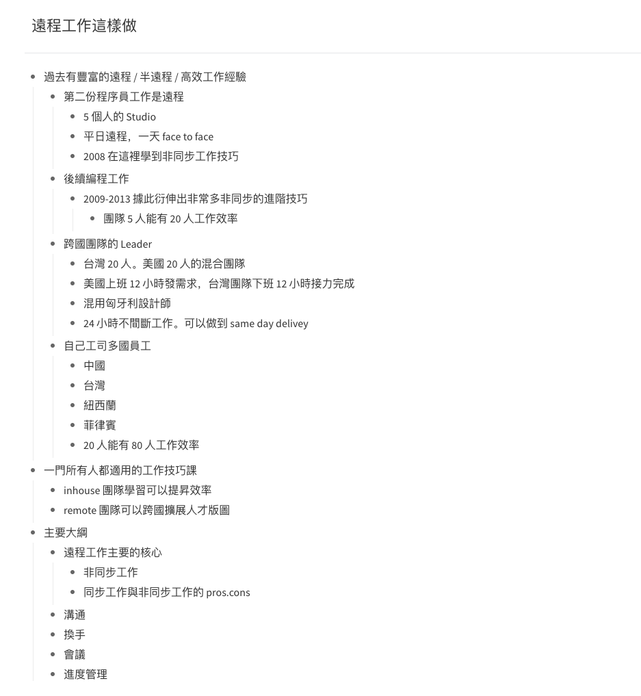
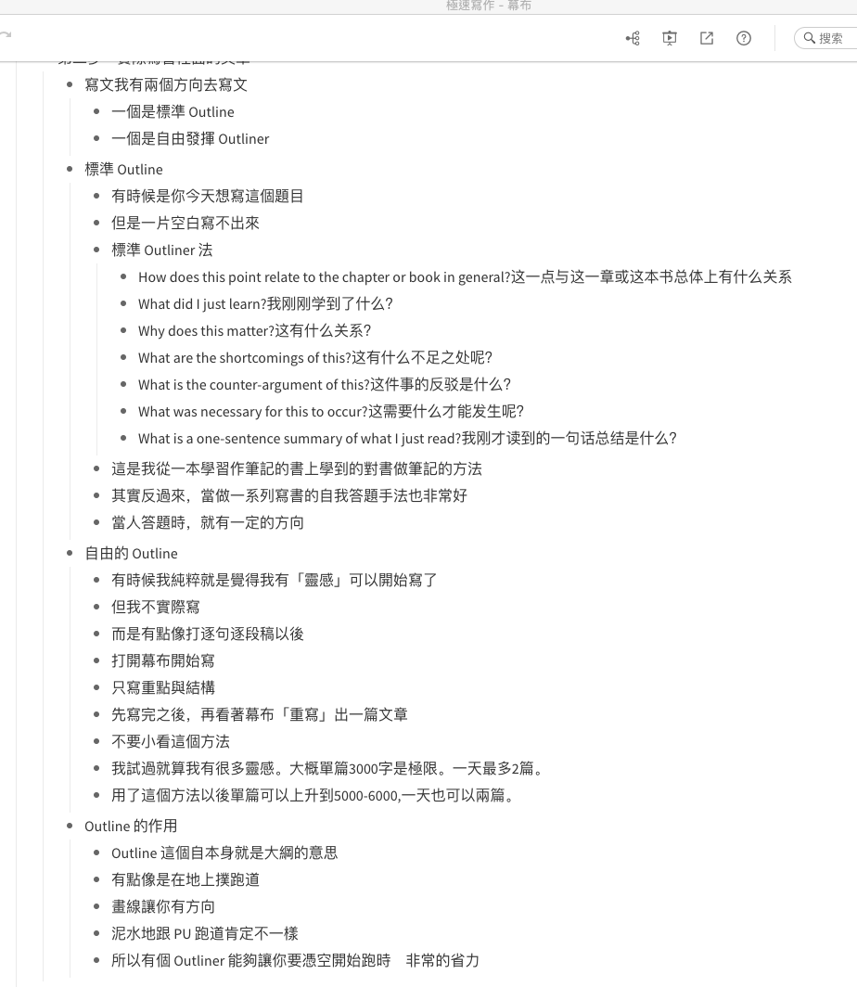
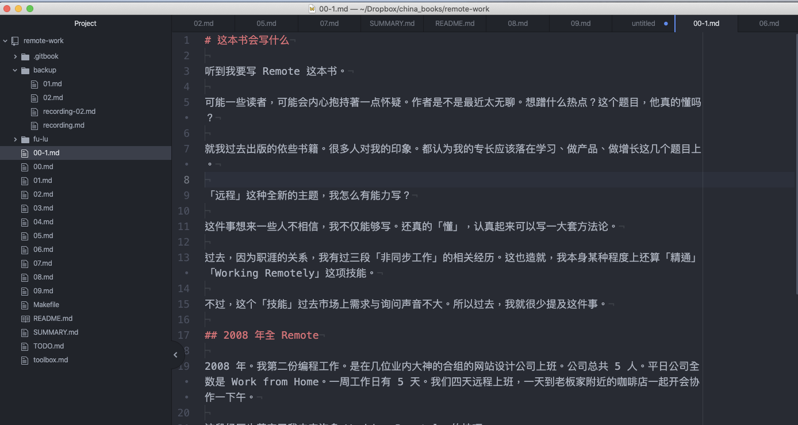

分出章节之后。如何开始写每一章的内容呢？

标准提词器

我会打开我的另外一个屏幕。放著这一排问题，促进我的灵感：

-   How does this point relate to the chapter or book in
    general?　这一点与这一章或这本书总体上有什么关系
-   What did I just learn?我刚刚学到了什么？
-   Why does this matter?这有什么关系？
-   What are the shortcomings of this?这有什么不足之处呢？
-   What is the counter-argument of this?这件事的反驳是什么？
-   What was necessary for this to occur?这需要什么才能发生呢？
-   What is a one-sentence summary of what I just
    read?我刚才读到的一句话总结是什么？

这一组问题。是我从某一本学习做笔记的书上，如何对书做总结的一套标准提问法。我很长时间都用这个方法做我的读书总笔记。

后来我在写作时，灵机一动。这个方法是看完别人的书，做总结用的。为什么我不能拿过来打大纲呢（预作总结）？

结果发现效果特别好。如果再把这一组问题重新组织起来。就是：

-   你现在要写的这一个章节，跟本书有什么关系呢？
-   你大概要讲的是什么概念？
-   为什么这个概念很重要？
-   有什么东西我们还没谈到？这个方法有没有什么缺点？
-   有没有什么反例呢？
-   反例要在什么情况下发生呢？
-   可不可以最后做个总结

每当我打开编辑器。脑袋却一片空白时，我就会用这个方法。一下就能写出一大堆了。

Outliner 法

我之前发明过一个极速读书法。极速读书法的原理是快速的捕捉书中的关键字、关键句、关键
IDEA。最后再一次整理完成自己的总结。

后来我把这个极速读书法，搬去电脑使用。改良的方法，是把书中的关键字、关键句、关键
IDEA　摘录下来。以「大纲」形式陈列。

{width="5.704305555555556in"
height="4.729886264216973in"}

改用这个方法后。我读书的速度更快了。写的笔记也有组织性。我后来就想，能不能也把这个方法反著用。

以前我可能灵感来了。可能是一次性的写整篇文章。但是我可不可以以后写文，不要先写文章，先写
Outline 试看看。

后来我发现，真的可以，还挺有效的。用这个方法。我可能用一篇 outline
就能够「写完」一篇 7000 字的长文。（Outline 约 500-700字）

{width="5.704305555555556in"
height="6.191333114610674in"}

我用 Outline 打完后。再看著 Outline
重写一遍。竟然就可以很快的产出一篇完整又很长的文章了。比如说你现在看的这本书这段章节。其实这就是這樣生出來的。

{width="5.704305555555556in"
height="6.655022965879265in"}

原本。我以前最早写作时。单篇长度极限是 3000 字。一天最多只能写 2
篇。现在改用这个方法后，单篇字数可以一口气就上
5-6000字。一天「最少」可以写两篇。一篇文章的 Outline。我可能花 10
分钟就能写完。

所以。我现在很少遇到「没有灵感」的问题。

因为「灵感」的本身，取决于两个关键因子「思绪连线」与「能量」。改用这个方式以后，我变得改用很低的成本取的思绪连线。再用相对比较少的耗能做到输出。

如果我们再把写作比拟回去「跑步」。打 Outline
这个方式更像是在地上划上跑道线，扑上跑道材料。原本我们在写书时，本来面对的是没有终点线，没有起点，没有终点。但现在经过这样的操作。我们知道起点在哪里、终点在哪里、要跑多长、每一段地形如何，更棒的是，可能我们还能跑在
PU 跑道上。

一天写出一本书的秘密配方

在我改用 Outline 写作法后，我一天最高产，大约能写 20000 字。大概就是 3-4
篇长文。

我一直在想。我能不能把这个数字拉上去。也许是 40000 字，也许是 60000
字。更狂的是，一天写出一本书。

当然，这都只是幻想而已。

我过去最厉害的纪录，也只不过是一周写出一本书（打造超人大脑）。那一次已经把我自己搞到筋疲力竭了。

后来，我在某次直播中，竟然无意中实践出一个神奇的方法。完成一天写一本书这个狂举。

大概是在 2020 年 5
月吧。有次在与朋友闲聊时，朋友就说因为疫情的关系，现在远距工作很夯，未来远距的非同步作业技巧应该会成为上班族必备的技能。我说：说来你不知。虽然我号称懂王（因为会太多东西，被酸民以为是假懂，所以讽刺我什么都懂），但是远距工作这个议题，我真的非常懂。

当时其他人也没在意。

但是因为这个话题我真是非常熟稔，毕竟是过去十多年上班练就的非同步工作技能。于是早上讲完，我下午竟然就认真做起了一个
50 页 PPT。还非常正经的说要开直播讲课（最终来了 30 人）。

这个 Talk 我讲了大约 1
小时，听众听完都感到很震撼。因为大家发现这个议题我不但是懂，而且是懂中之懂。

而且\...

我隔天觉得讲完意犹未尽，我就花了 24 小时，写了约 44000 字，把这本书的 V1
写完了。

这个举动真是吓到我周遭所有人了。包括也吓到我自己。连我自己都没想到可以一口气写这么多字。可惜后面体力真是不行了。否则我觉得这次有机会一口气写到
60000 字。

{width="3.638472222222222in"
height="2.4566666666666666in"}

(可以看到我刚开始可以一次写 8000，后面就只能一次写 4000，然后就掉到 2000
)

我是怎么做的呢？

Step 1: 画 A-\> B

刚开始我本来都没有写书的念头。所以只是抱持著做个小课的念头

{width="5.704305555555556in"
height="4.278229440069992in"}

透过这个梳理。我发现大家比较关心沟通的几个议题。

Step 2: 打投影片 Outline

然后，我就开始写投影片 Outline

{width="5.704305555555556in"
height="9.431227034120734in"}

Step 3: 然后做成投影片

{width="5.704305555555556in"
height="4.653105861767279in"}

Step 4: 上 Zoom 直播

{width="5.704305555555556in"
height="3.2467191601049867in"}

Step 5 : 　转档成逐字稿

{width="5.704305555555556in"
height="3.1241076115485567in"}

Step 6 : 　重写成书稿

然后我看著这些逐字稿的大概内容。重写（这次不是剪辑搬运逐字稿，是看著稿子空手切快写的\...）

{width="5.704305555555556in"
height="3.0370909886264217in"}

早知道。我应该要对书再打一次 Outline
的。因为空手写，后面体力就下降的超快。

{width="3.638472222222222in"
height="2.4566666666666666in"}

当然。因为这本书写的如此之快、之深。编辑也是瞬间就跟我签了这本书的出版合约。

当然，这个版本并不是这本书出版的最后版本。我们在后面会讲到如何后期打磨。
