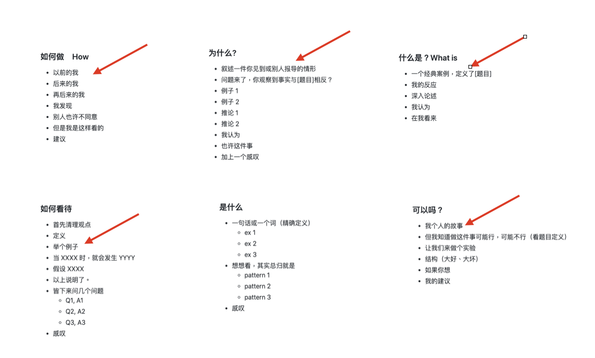

# 如何將文章寫的好看 -- 故事篇

今天，我們要來談談「故事」這個主題。

你一定會覺得很疑惑。明明我寫的書是圍繞著 Non-Fiction 的書在探討的寫作技巧。為什麼我要談故事技巧呢？

這裡。我來講一個段子：

在我剛開始寫書時，也是一邊寫一邊讓人試讀的。試讀者讀完我的書後跟我說，Xdite，你書裡面寫的不錯，乾貨很多。但是，你可以多寫點故事在裡面嗎？不然這本書有點太乾了。

我當時聽不懂，還以為人家是在誇我書寫的好，，乾貨很多乾到爆。

後來我才知道這個反饋背後的意思。

我不知道各位讀者有沒有去讀過編程的書。這些書都有一個共通特點，就是難以下嚥，幾乎就都是步驟例子步驟例子而已。不過，雖然普通人覺得編程書很難讀。但是程序員卻不這麼認為，程序員會覺得書裡面廢話越少越好。一本的編程書，最好就是單刀直入就開始講例子講原理講怎麼操作。如果一本書裡面，鋪陳的太多，故事書。大家還會覺得這本書太水是寫來騙錢的沒什麼技術含量。

我是程序員出身的。所以你就知道我真的是完全不懂別人在說什麼。還以為人家在誇我。

哈哈哈哈哈。

## 一本書如果沒有故事，那麼就只是一本操作手冊。

前面說到。在出書過程中，會有一個 V1 => V2 的階段。。這個時候，如果一本書字數太少（只有40000字）。編輯就會要求作者回去補內容。而補故事是最好的「灌水手段」。

我在寫第一本書時，字數也很少。大概就大概四萬多字而已。再寫我也掰不出來了。剛開始不懂編輯跟我說的補故事是什麼意思，他只跟我說補故事會更好、更好理解。

我還是聽不懂什麼意思。不過我為了要讓書更好看。本著我的研究精神，去找了很多我以前覺得很好看的書。看它們怎樣寫的。

不看還好。我就發現了一件震驚的事實。恩，我的書雖然乾貨很多，但跟這些過去我覺得好看的書比起來。這些「好看的書」更像是故事書，而我的V1書更像是一本操作手冊。

而且，不是只有一本有這樣的現象。我發現，那些我喜歡的那一排書，在我的印象裡面它們應該都是教條書（因為我從那些書裡面，學了很多原則），結果我在重看時，發現它們每一本都是「故事書」！！！

我完全不明白這是什麼道理！！！

不過既然寫故事大家喜歡看，我就只好補進去了。補了以後果然好看蠻多的了。

為什麼你要在文章裡面加故事

在上一章我們介紹了六個寫作模版。讓我們拉近看看

{width="5.704305555555556in"
height="3.4286515748031494in"}

你會發現！？！？怎麼會這樣。我們以為寫文章就寫文章，寫清?自己論點好了。但是，好像每一篇好文章背後都真的有例子或故事耶！

是的。好看的文章，一定是故事與論點並呈的。

這是因為，大腦寫進記憶都是以「記憶鏈」的方式。如果你憑空要讓大腦記住 9
個特徵點，這是完全不可能的事。

但是如果你是以一篇故事的結構去呈現，對大腦來說，那就容易的接受的多。這裡我說個例子好了，如果你早上請假。下午到了公司，老板問你早上為啥沒來，你只說生病，他一定會問你什麼病，去哪家醫院，疑神疑鬼，可能大概率還懷疑你是玩手機不小心通宵了。但如果你主動先說，昨天晚上點了個外賣，大概外賣不新鮮，所以拉了一晚上。他一定會立馬接受這個說法，可能還要你今天別幹活了，沙發躺著休息。

這是因為人類需要有一個「信息鏈」去接收他接受的訊息。有時候你發現真的隨便編個故事都比說「私事」令人信服。

而如果你的書，只有論點。其實是很難讓人記住與相信的。

1.  你沒有解釋這個道理是怎麼來的

2.  就算你解釋的步驟再鉅細靡遺，對讀者來說也沒有意義，因為他必須要「練習」才能
    GET 到你的重點，「燒」進記憶裡。

所以這就是為什麼一篇好的文章，往往都是故事與論點並呈的。

要如何把故事寫進文章裡面

但話說回來，我們知道要在文章裡面寫故事。但是，這在寫作裡面並不是容易辦到的事情。這有幾個原因

1.  你在書寫的時候，腦子最後就只記得道理與 SOP
    而已。要你另外新生一個「完美」故事去搭配這個論點真的有點困難

2.  有時候寫作的時候，的確會想要順便寫點故事。但是寫著寫著，卻發現很難。因為要講清楚整個故事，非常費勁。有時候會不小心就寫歪樓，或者不小心故事就寫太長，寫到難以剪輯。甚至是寫完故事以後，就累了。不想寫文。

3.  有時候自己並沒有好例子。但是記得網上有人的例子不錯，結果去找了老半天，不是忘記來源在哪裡，就是找來找去沒有容易剪的。

總之，寫到一半遇到要剪故事，真的很傷腦筋。不寫不好看，要寫又沒有好方式。這就像想上廁所，褲子都拉一半了，結果馬桶竟然堵了一樣，不知道要換另外一間廁所還是拿起通馬桶棍認真清理一樣讓人哭笑不得。

所以，書籍作者不是不想寫故事。是因為寫文章時，常常遇到這種事。莫名其妙，自己的靈感可能就被故事擋住。不寫故事覺得不精彩，寫了故事以後莫名其妙跑去修故事，故事寫完以後就沒力寫後面的論點。

所以，我們要怎麼樣在寫作裡，處理這個問題。很簡單，切開來寫。

一篇文章，或一個章節，內容還可以切成三部分。

分別是

-   Story 故事、例子、經驗

<!-- -->

-   Lesson 論點、步驟、教訓

<!-- -->

-   Action / Other 結論、行動指南、FAQ

寫 Lesson 其實是最簡單的。你可以先寫 Lesson，遇到故事點，就先打個
\[這裡寫XXX故事\]，然後整個跳過去。繼續把你論點寫完再回去找故事。

我在寫我一本書「閃電式開發」時，其實也是用這個大法。閃電式開發是一本教大家創業時如何順利將產品做出來、測試市場、團隊協作、打磨產品、增長循環的書。裡面有一半幾乎也是我創業時候的故事與一些慘痛的坑。

這本書，本質上也涉及到大量的故事。

所以，我用了很邪惡的一招。我是怎麼做的呢？本書第一章不是教大家先用 A-\>
B 理論找架構，找段落標題嗎？

因為我一開始就知道這本書我要寫哪 10
個標題了。於是我大概知道這本書會有什麼走向。所以我拿一張紙，在每個標題後面寫，大概會有什麼故事。

然後我就做了一個虐待觀眾的直播。我在那個直播上，一口氣就把這本書可能涉及到的所有故事全部講了。再把影片轉成逐字稿。而這份逐字稿，就成了我的故事百寶箱。

只要我書寫段落需要，我就去這個故事百寶箱裡面，撈出來剪進去。

這樣就算我書裡面同時有好幾章用到同一個故事也沒關係。我不會有重複回憶的情況，只要按照需要去把內容剪出來就好。

如何寫出一個好故事

故事有兩種來源。一種是自己的，一種是別人的。在寫書時，一般來說，寫自己的故事總是最好的。一來寫起來比較快，只要憑記憶就可寫出來，一方面是是寫起來比較可信。

如果寫別人的。你不但要去查，還要去想辦法剪輯成「比較原創」的口吻。

那看到這裡，讀者可能會想問，這本書好像都在談模版。那寫故事有好模版嗎？

有！

這個方法是我 2019
去上一個營銷課學寫軟文時（媒老板商學院：超級文案與賣貨。賀奕棋老師）學到的。

他指出要寫出一個好的品牌故事，需要六個元素：

-   \[**一个敌人**\]
    让你（你的客户）产生困扰的因素，你想打败的东西，最终想达到的目标。比如熬夜越来越严重，颈椎越来越重压，食物添加剂越来越多等等，创业是为了解决这些问题，这些问题就是你的敌人。

<!-- -->

-    \[**一个猪队友**\]
    同行竞品，指责他们没有做好的地方，比如用糟糕的原材料、糟糕的设计、打乱市场规则，伤害消费者利益等等。

<!-- -->

-    \[**ㄧ个英雄**\] 就是创始人、品牌方，你有着和顾客-
    样的问题，然后努力去解决，最后得到了你的产品。

<!-- -->

-   \[**一些冲突**\]你在做产品过程中，遇到的一些阻碍。

<!-- -->

-   \[**一个修行**\]你是怎样去做产品的，大致的故事经过是怎样。

<!-- -->

-   \[**一个失败**\]讲一个你在做产品中失败的经历，或者人生低谷的阶段。这个失败最好是你为顾客的利益，而选择自己承受代价的失败。

<!-- -->

-    \[**一场胜利**\]产品搞出来之后，一次大卖、热销的经历。

其實這個方法。也可運用在一般寫故事上。如果在寫作拾大腦一片空白，可以先寫下這六個元素。就很有靈感了。

比如說如果我要寫極速寫作法出版由來這件事，我可能就會這樣整理。

-   敵人：寫不出來，老是重寫前言與 1-3 章。

<!-- -->

-   豬隊友：面對白紙一片空白。編輯都不教我怎要寫。

<!-- -->

-   英雄：我在網上看到一個快速出書的公司。它們幫名人出書的方式，是設計一系列的問題訪問它們，最後整理逐字稿變成書。讓我有了直播寫書的靈感

<!-- -->

-   衝突：寫書變的輕鬆了。但改稿真的很累。

<!-- -->

-   一個修行：後來我學著去從做遊戲的方式，學對內容作分段。然後一邊寫文章一邊打電動

<!-- -->

-   一個失敗：剛開始花了一個月寫書，這個月啥事都不能做。精神又痛苦又掙扎。所以我花了很多時間去各領域，鑽研各種能讓自己寫更快的方法。

<!-- -->

-   一場勝利：後來我找到方法後，從完全靠演講寫書，到一個月寫一本書，到一週寫一本書，後來到一天能寫一本書。到後來編輯甚至邀請我寫一本關於寫作法的書。

＝＝＝＝

故事：

我曾經是一個故事與經歷很豐富的程序員。一直想要整理過去的經歷變成書分享給大家。但是從想寫書，到真的寫成第一本紙質書。大概也花了快十年的時間。

雖然我本身曾是一個眾所周知，寫文速度非常快的博客主，但是寫書這件事，還真不是普通的困難。我曾經無數次自己用各種工具寫書。但老是從入門到放棄。因為我發現，在寫書上，我老是敗在一個難關：完美病，走不出來。明明我有很多想寫的東西，卻老是在前言與
1-3 章無窮迴圈，無限重寫與改稿。怎麼樣也推進不了。

最後，有個契機。我在寫第一本書時，無意時用一個方法寫出來了。這個方法就是課程逐字稿方式。我先做一個課程，然後請人打字變成一個逐字稿，竟然用這種土法煉鋼的方式，寫成了第一本書。

後來，我在網上，看到了一個公司 Book in a Box
公司，它們幫名人出書的方式，也是用預先準備問題的方式，採訪名人。最後整理成書稿。我才慢慢破解寫作的奧秘。

用著土法煉鋼的方式，我後來也用一個月的時間，把我第二本書「閃電式開發」寫出來。然而，在這個寫作過程中，雖然比寫第一本書時有條理許多。但是還是非常痛苦。我常遇到改稿、改章節、太痛苦一直逃避寫作等等問題。

但是，因為我已經開始藉由寫作書籍這件事，漸漸掌握了製作長篇內容的奧秘。我把遇到的問題，一個一個用跨領域的方法解決。包括使用遊戲界設計關卡的方式，去梳理書籍架構。用一邊打電動的方式，去激發多巴胺讓自己有動力繼續寫書。。。。等等等。

在我寫完第二本書之後，我竟然大致整理出一個框架。為了要實驗這個框架。我竟然很
crazy
的進行了一個實驗，想要在接下來的兩個禮拜，寫出下一本書，去證實這個方法是否有效。結果沒想到，因為這個題目的題材我很熟悉，竟然最後在一個禮拜就寫完了一本書。這本書就是打造超人大腦。

後來，在一年後，我的朋友希望我寫打造超人大腦的續集，剛好因為
COVID-19，我人被困在台灣，編輯看我沒有什麼事情作，於是希望我花時間把這本書寫完。後來，這本書「打造超人思維」我是花時間寫完了。但是，因為是勉強寫的。對質量還有一些不是很滿意。

寫完「打造超人思維」那一週。我朋友在跟我聊遠程工作的事。關於這個主題，我剛好是專家。我對講這個主題，非常有興趣。當天就做了一個投影片，晚上小小開了課。因為做這個課的時候，我還蠻
high
的，甚至還跟編輯提議說，因為我在寫打造超人思維時，有一些細節不是很滿意。而且我認為遠程工作這個題目應該很夯，是否可以花一週時間，我寫下一本書交換。

打造超人思維則 shift
到下一個檔期再出。編輯因為相信我的寫作速度，就答應了。

沒想到，因為這本書的題材我太熟悉，加上在寫作時，也用了我最近一年累計的一些新工具與手段。這本書，我竟然只花了一天的時間就寫出了乾貨滿滿的第一版（44000字）。

原本以為寫完這本書就沒事了。沒想到編輯在跟我補簽「遠程工作這樣做」時，他覺得我的新型寫作方法實在太厲害了，如果整理出來，應該可以造福很多作者與出版社。

這就是這本書的由來。

＝＝＝＝

你看。用這個方法去寫故事是不是很簡單呢？先把六個關鍵點找出來，你就會發現靈感一下子就冒出來，寫都寫不完。

不管是你自己的故事，或者是網路上的故事，你都可以用這套方法去改寫。

其實這六個關鍵點，就是一般寫電影劇本或者是故事時，常用的技巧變形而已。有更長版本的，也有更短版本的。

如果你對寫故事很有興趣的話。我推薦另外兩本書，大家可以參考看看：

-   布萊克．史奈德 \-\-- 先讓英雄救貓咪：你這輩子唯一需要的電影編劇指南

<!-- -->

-   許榮哲 \-\-- 3分鐘說18萬個故事，打造影響力

可以用其他方法替代故事寫作嗎？

有些讀者會覺得。寫故事難度還是太高。要「灌內容」的方法有很多種。比如說新聞報導、統計數據、專業論文，這些都可以剪進去當作內容的一部份。

為什麼要鎖死在「故事」這個格式裡面？

我本來也是這樣想的。但是，不知道為何，當我在讀別人的書裡面，讀到新聞報導、統計數據、專業論文，卻老是總感覺很遙遠。反而要是作者將之編成了一個故事，或者是以他自己的角度去敘述個人經驗，不知道為什麼，我總是會印象深刻。

後來，我在「超越感覺：批判性思考指南」（這是一本心裡學的書，探討人類錯覺）這本書裡面，意外的發現了這件事，科學研究，人們對體裁的相信度是這樣的：

{width="5.704305555555556in"
height="4.274425853018372in"}

而且，這跟一個人的智商高低，是沒有什麼相關連的。

這是因為，人們在做判斷與記憶寫入時，更依賴的是「感覺」與「感情」。而不是冰冷的數字與圖表。就如同上面我提到的，人們對一件事的寫入需要「記憶鏈」作為載體。如果你只是陳述論點與數據，並不會對一個人的心智產生任何影響，因為他需要鍛鍊或者親身經歷，才有辦法理解。

但是作為一個故事，讀者卻很容易在聽完之後產生共情，進而相信與記憶。

所以，如果你手上有什麼體裁。我建議都可以盡量加工成故事版本。這樣可以為你的書籍或文章大大加強可信力度。
