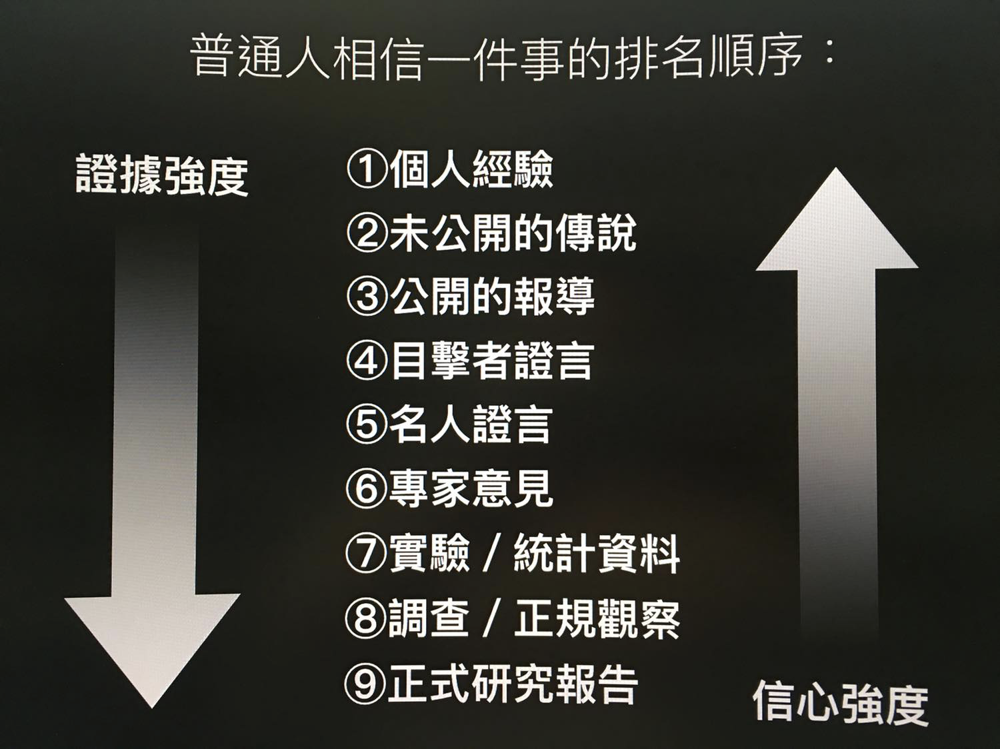

# 如何将文章写的好看 -- 故事篇

今天，我们要来谈谈「故事」这个主题。

你一定会觉得很疑惑。明明我写的书是围绕着 Non-Fiction 的书在探讨的写作技巧。为什么我要谈故事技巧呢？

这里。我来讲一个段子：

在我刚开始写书时，也是一边写一边让人试读的。试读者读完我的书后跟我说，Xdite，你书里面写的不错，干货很多。但是，你可以多写点故事在里面吗？不然这本书有点太干了。

我当时听不懂，还以为人家是在夸我书写的好，，干货很多干到爆。

后来我才知道这个反馈背后的意思。

我不知道各位读者有没有去读过编程的书。这些书都有一个共通特点，就是难以下咽，几乎就都是步骤例子步骤例子而已。不过，虽然普通人觉得编程书很难读。但是程序员却不这么认为，程序员会觉得书里面废话越少越好。一本的编程书，最好就是单刀直入就开始讲例子讲原理讲怎么操作。如果一本书里面，铺陈的太多，故事书。大家还会觉得这本书太水是写来骗钱的没什么技术含量。

我是程序员出身的。所以你就知道我真的是完全不懂别人在说什么。还以为人家在夸我。

哈哈哈哈哈。

## 一本书如果没有故事，那么就只是一本操作手册。

前面说到。在出书过程中，会有一个 V1 => V2 的阶段。。这个时候，如果一本书字数太少（只有40000字）。编辑就会要求作者回去补内容。而补故事是最好的“灌水手段”。

我在写第一本书时，字数也很少。大概就大概四万多字而已。再写我也掰不出来了。刚开始不懂编辑跟我说的补故事是什么意思，他只跟我说补故事会更好、更好理解。

我还是听不懂什么意思。不过我为了要让书更好看。本着我的研究精神，去找了很多我以前觉得很好看的书。看它们怎样写的。

不看还好。我就发现了一件震惊的事实。恩，我的书虽然干货很多，但跟这些过去我觉得好看的书比起来。这些“好看的书”更像是故事书，而我的V1书更像是一本操作手册。

而且，不是只有一本有这样的现象。我发现，那些我喜欢的那一排书，在我的印象里面它们应该都是教条书（因为我从那些书里面，学了很多原则），结果我在重看时，发现它们每一本都是“故事书”！！！

我完全不明白这是什么道理！！！

不过既然写故事大家喜欢看，我就只好补进去了。补了以后果然好看蛮多的了。

## 为什么要在文章里面加故事

在上一章我们介绍了六个写作模版。让我们拉近看看

你会发现！？！？怎么会这样。我们以为写文章就写文章，写清?自己论点好了。但是，好像每一篇好文章背后都真的有例子或故事耶！

是的。好看的文章，一定是故事与论点并呈的。

这是因为，大脑写进记忆都是以“记忆链”的方式。如果你凭空要让大脑记住 9
个特征点，这是完全不可能的事。

但是如果你是以一篇故事的结构去呈现，对大脑来说，那就容易的接受的多。这里我说个例子好了，如果你早上请假。下午到了公司，老板问你早上为啥没来，你只说生病，他一定会问你什么病，去哪家医院，疑神疑鬼，可能大概率还怀疑你是玩手机不小心通宵了。但如果你主动先说，昨天晚上点了个外卖，大概外卖不新鲜，所以拉了一晚上。他一定会立马接受这个说法，可能还要你今天别干活了，沙发躺着休息。

这是因为人类需要有一个“信息链”去接收他接受的讯息。有时候你发现真的随便编个故事都比说“私事”令人信服。

而如果你的书，只有论点。其实是很难让人记住与相信的。

1.  你沒有解釋這個道理是怎麼來的
2.  就算你解釋的步驟再鉅細靡遺，對讀者來說也沒有意義，因為他必須要「練習」才能 GET 到你的重點，「燒」進記憶裡。

所以這就是為什麼一篇好的文章，往往都是故事與論點並呈的。

## 要如何把故事寫進文章裡面

但话说回来，我们知道要在文章里面写故事。但是，这在写作里面并不是容易办到的事情。这有几个原因

1.  你在书写的时候，脑子最后就只记得道理与 SOP
    而已。要你另外新生一个“完美”故事去搭配这个论点真的有点困难
2.  有时候写作的时候，的确会想要顺便写点故事。但是写着写着，却发现很难。因为要讲清楚整个故事，非常费劲。有时候会不小心就写歪楼，或者不小心故事就写太长，写到难以剪辑。甚至是写完故事以后，就累了。不想写文。
3.  有时候自己并没有好例子。但是记得网上有人的例子不错，结果去找了老半天，不是忘记来源在哪里，就是找来找去没有容易剪的。

总之，写到一半遇到要剪故事，真的很伤脑筋。不写不好看，要写又没有好方式。这就像想上厕所，裤子都拉一半了，结果马桶竟然堵了一样，不知道要换另外一间厕所还是拿起通马桶棍认真清理一样让人哭笑不得。

所以，书籍作者不是不想写故事。是因为写文章时，常常遇到这种事。莫名其妙，自己的灵感可能就被故事挡住。不写故事觉得不精彩，写了故事以后莫名其妙跑去修故事，故事写完以后就没力写后面的论点。

所以，我们要怎么样在写作里，处理这个问题。很简单，切开来写。

一篇文章，或一个章节，内容还可以切成三部分。

分别是

-   Story 故事、例子、经验
-   Lesson 论点、步骤、教训
-   Action / Other 结论、行动指南、FAQ

写 Lesson 其实是最简单的。

你可以先写 Lesson，遇到故事点，就先打个\[这里写XXX故事\]，然后整个跳过去。继续把你论点写完再回去找故事。

我在写之前一本书“闪电式开发”时，其实也是用这个大法。

闪电式开发是一本教大家创业时如何顺利将产品做出来、测试市场、团队协作、打磨产品、增长循环的书。里面有一半几乎也是我创业时候的故事与一些惨痛的坑。

所以这本书本质上涉及到大量的故事。但是寫故事，其實是非常費勁的。特別是這些回憶裡面，有極度快樂的也有極度痛苦的。有些事我其實真不是很想回憶。

我在寫作時還特別不喜歡寫故事的一個原因，是因為寫作的時候，這些回憶會激發大量的情緒（不管是好的還是不好的）。而且在編輯故事時，為了內容需要，也需要進行大量的剪裁與修剪。這就讓整個寫作過程變得很困難。寫一寫就容易停下來。

所以，當時我在寫作時，就用了很邪恶的一招。寫這些故事不是很痛苦很費勁嗎？那我就整組拆出來一口氣寫阿。

本來這事情是不可能的。但是因為我用 A-> B 打稿的關係。於是在實際進行內容前，我已經大概知道這本書會有什麼走向了

所以我拿了一张纸，在每个标题后面整理，哪一章大概会提什么故事。

然後，看著這張紙，做了一个虐待观众的直播。在那个直播上，我一口气就把这本书可能涉及到的所有故事全部讲完。

再把影片转成逐字稿。

而这份逐字稿，就成了我這本書的故事百宝箱。

只要寫到該段落，需要一個故事。就去这个故事百宝箱里面，捞出来剪进去。

这样就算书里面同时有好几章用到同一个故事也没关系。我不需要重复回進行回忆改寫，只要按照需要去把内容剪出来就好。

## 如何写出一个好故事

故事有两种来源：

* 一种是自己的
* 一种是别人的

在写书时，一般来说，写自己的故事总是最好的。一来写起来比较快，只要凭记忆就可写出来，一方面是是写起来比较可信。

如果是写别人的故事。寫作時不僅要停下來去查，还要去想办法剪辑成“比较原创”的口吻。其實挺費盡的

看到这里，读者可能会舉手發问。这本书好像都在谈模版。那写故事有好模版吗？

有！

这个方法是我 2019 去上一个营销课学写软文时（媒老板商学院：超级文案与卖货。贺奕棋老师）学到的。

他指出要写出一个好的品牌故事，需要六个元素：

-   \[**一个敌人**\]
    让你（你的客户）产生困扰的因素，你想打败的东西，最终想达到的目标。比如熬夜越来越严重，颈椎越来越重压，食物添加剂越来越多等等，创业是为了解决这些问题，这些问题就是你的敌人。
-    \[**一个猪队友**\]
    同行竞品，指责他们没有做好的地方，比如用糟糕的原材料、糟糕的设计、打乱市场规则，伤害消费者利益等等。
-    \[**ㄧ个英雄**\] 就是创始人、品牌方，你有着和顾客-
    样的问题，然后努力去解决，最后得到了你的产品。
-   \[**一些冲突**\]你在做产品过程中，遇到的一些阻碍。
-   \[**一个修行**\]你是怎样去做产品的，大致的故事经过是怎样。
-   \[**一个失败**\]讲一个你在做产品中失败的经历，或者人生低谷的阶段。这个失败最好是你为顾客的利益，而选择自己承受代价的失败。
-    \[**一场胜利**\]产品搞出来之后，一次大卖、热销的经历。

其实这个方法。也可运用在一般写故事上。如果在写作拾大脑一片空白，可以先写下这六个元素。就很有灵感了。

比如说如果我要写极速写作法出版由来这件事，我可能就会这样整理。

-   敌人：写不出来，老是重写前言与 1-3 章。
-   猪队友：面对白纸一片空白。编辑都不教我怎要写。
-   英雄：我在网上看到一个快速出书的公司。它们帮名人出书的方式，是设计一系列的问题访问它们，最后整理逐字稿变成书。让我有了直播写书的灵感
-   冲突：写书变的轻松了。但改稿真的很累。
-   一个修行：后来我学着去从做游戏的方式，学对内容作分段。然后一边写文章一边打电动
-   一个失败：刚开始花了一个月写书，这个月啥事都不能做。精神又痛苦又挣扎。所以我花了很多时间去各领域，钻研各种能让自己写更快的方法。
-   一场胜利：后来我找到方法后，从完全靠演讲写书，到一个月写一本书，到一周写一本书，后来到一天能写一本书。到后来编辑甚至邀请我写一本关于写作法的书。

＝＝＝＝

故事：

我曾经是一个故事与经历很丰富的程序员。一直想要整理过去的经历变成书分享给大家。但是从想写书，到真的写成第一本纸质书。大概也花了快十年的时间。

虽然我本身曾是一个众所周知，写文速度非常快的博客主，但是写书这件事，还真不是普通的困难。我曾经无数次自己用各种工具写书。但老是从入门到放弃。因为我发现，在写书上，我老是败在一个难关：完美病，走不出来。明明我有很多想写的东西，却老是在前言与
1-3 章无穷回圈，无限重写与改稿。怎么样也推进不了。

最后，有个契机。我在写第一本书时，无意时用一个方法写出来了。这个方法就是课程逐字稿方式。我先做一个课程，然后请人打字变成一个逐字稿，竟然用这种土法炼钢的方式，写成了第一本书。

后来，我在网上，看到了一个公司 Book in a Box
公司，它们帮名人出书的方式，也是用预先准备问题的方式，采访名人。最后整理成书稿。我才慢慢破解写作的奥秘。

用着土法炼钢的方式，我后来也用一个月的时间，把我第二本书“闪电式开发”写出来。然而，在这个写作过程中，虽然比写第一本书时有条理许多。但是还是非常痛苦。我常遇到改稿、改章节、太痛苦一直逃避写作等等问题。

但是，因为我已经开始借由写作书籍这件事，渐渐掌握了制作长篇内容的奥秘。我把遇到的问题，一个一个用跨领域的方法解决。包括使用游戏界设计关卡的方式，去梳理书籍架构。用一边打电动的方式，去激发多巴胺让自己有动力继续写书。。。。等等等。

在我写完第二本书之后，我竟然大致整理出一个框架。为了要实验这个框架。我竟然很
crazy
的进行了一个实验，想要在接下来的两个礼拜，写出下一本书，去证实这个方法是否有效。结果没想到，因为这个题目的题材我很熟悉，竟然最后在一个礼拜就写完了一本书。这本书就是打造超人大脑。

后来，在一年后，我的朋友希望我写打造超人大脑的续集，刚好因为
COVID-19，我人被困在台湾，编辑看我没有什么事情作，于是希望我花时间把这本书写完。后来，这本书“打造超人思维”我是花时间写完了。但是，因为是勉强写的。对质量还有一些不是很满意。

写完“打造超人思维”那一周。我朋友在跟我聊远程工作的事。关于这个主题，我刚好是专家。我对讲这个主题，非常有兴趣。当天就做了一个投影片，晚上小小开了课。因为做这个课的时候，我还蛮
high
的，甚至还跟编辑提议说，因为我在写打造超人思维时，有一些细节不是很满意。而且我认为远程工作这个题目应该很夯，是否可以花一周时间，我写下一本书交换。

打造超人思维则 shift
到下一个档期再出。编辑因为相信我的写作速度，就答应了。

没想到，因为这本书的题材我太熟悉，加上在写作时，也用了我最近一年累计的一些新工具与手段。这本书，我竟然只花了一天的时间就写出了干货满满的第一版（44000字）。

原本以为写完这本书就没事了。没想到编辑在跟我补签“远程工作这样做”时，他觉得我的新型写作方法实在太厉害了，如果整理出来，应该可以造福很多作者与出版社。

这就是这本书的由来。

＝＝＝＝

你看。用这个方法去写故事是不是很简单呢？先把六个关键点找出来，你就会发现灵感一下子就冒出来，写都写不完。

不管是你自己的故事，或者是网路上的故事，你都可以用这套方法去改写。

其实这六个关键点，就是一般写电影剧本或者是故事时，常用的技巧变形而已。有更长版本的，也有更短版本的。

如果你对写故事很有兴趣的话。我推荐另外两本书，大家可以参考看看：

-   布莱克．史奈德 --- 先让英雄救猫咪：你这辈子唯一需要的电影编剧指南
-   许荣哲 --- 3分钟说18万个故事，打造影响力

## 可以用其他方法替代故事写作吗？

有些读者会觉得。写故事难度还是太高。要“灌内容”的方法有很多种。比如说新闻报导、统计数据、专业论文，这些都可以剪进去当作内容的一部份。

为什么要锁死在“故事”这个格式里面？

我本来也是这样想的。但是，不知道为何，当我在读别人的书里面，读到新闻报导、统计数据、专业论文，却老是总感觉很遥远。反而要是作者将之编成了一个故事，或者是以他自己的角度去叙述个人经验，不知道为什么，我总是会印象深刻。

后来，我在“超越感觉：批判性思考指南”（这是一本心里学的书，探讨人类错觉）这本书里面，意外的发现了这件事，科学研究，人们对体裁的相信度是这样的：

而且，这跟一个人的智商高低，是没有什么相关连的。

这是因为，人们在做判断与记忆写入时，更依赖的是“感觉”与“感情”。而不是冰冷的数字与图表。就如同上面我提到的，人们对一件事的写入需要“记忆链”作为载体。如果你只是陈述论点与数据，并不会对一个人的心智产生任何影响，因为他需要锻炼或者亲身经历，才有办法理解。

但是作为一个故事，读者却很容易在听完之后产生共情，进而相信与记忆。

所以，如果你手上有什么体裁。我建议都可以尽量加工成故事版本。这样可以为你的书籍或文章大大加强可信力度。
