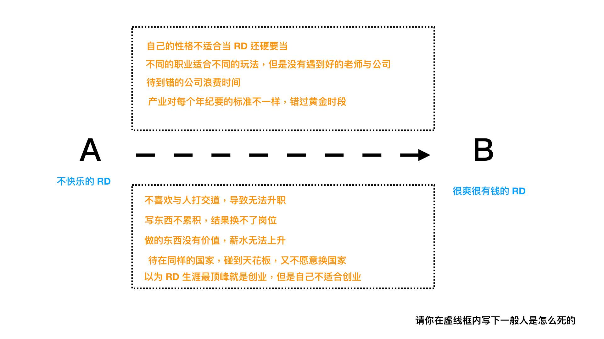
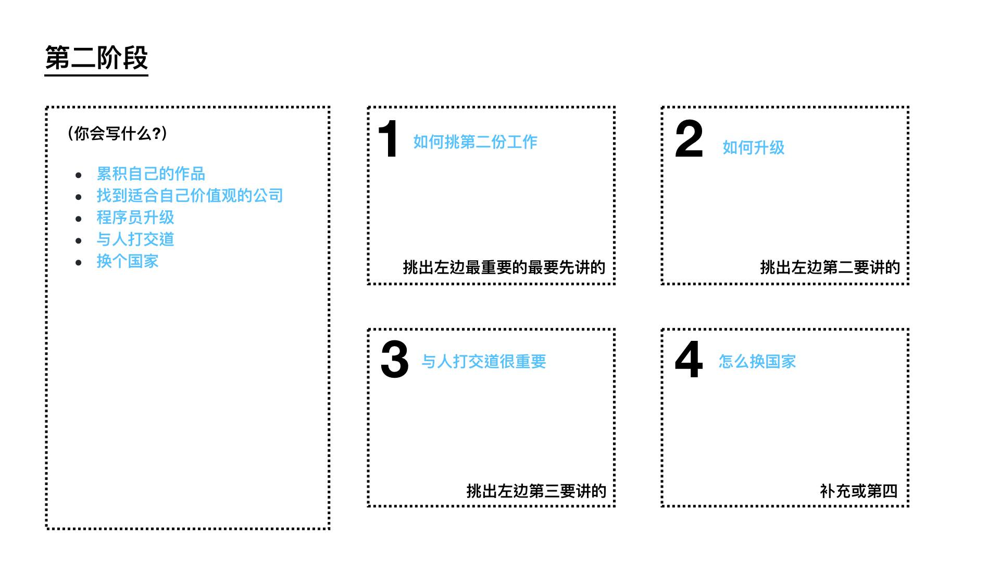
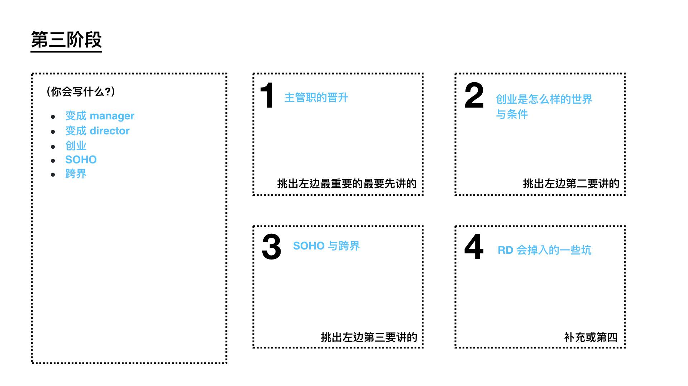

# 第二步：打出这本书的主架构

为什么我们要做这样的一道打架构的动作呢？其实是因为写书实在是一道相对漫长以及耗费精力的过程。作者们会写到绝望，往往是鬼打墙，觉得自己看不到终点。

利用这个方法，作者就会有比较明确的写作目标。就算是跑马拉松，你也得知道起点、终点在哪吧。

利用这个方法，你不仅可以知道起点与终点在哪里，并且還知道跑这一段马拉松，会经过哪些不一样的地形，如何配速跑过这些地形。

一般来说，一本200-300 页的完稿字数约在 80000 字上下。然后出版社接收的第一稿约 60000 字。所以分到 3 个 Section，一个 Section 就是两万字，一个 Section 四篇文章，一篇文章就是 5000
字。如果分到 4 个 Section，一个 Section 就是 15000字，一个 Section 三篇文章，一篇文章也是 5000 字。

所以算一下，就是写 12 篇文章，每篇 5000 字。这样下来看起来有没有容易一些了。

找到了这个 Section 后，我就会开始在这个 Section 下草拟一下我可能想要写的主题，再排定优先权。

因为每么章节，一定有需要优先写的题目，當然也一定有相对枝微末节的题目。

比如在 \<\<闪电式开发\>\> 这本书里面的 IDEA 篇，

我可能可以写的题目就有：

* 如何鉴定哪一些是可以做的 IDEA
* 哪一些是可以赚钱的 IDEA
* 创业路上常见的小错，但是犯了就会挂掉
* 如何做出成功的第一版 IDEA

但其实这些题目是有优先级顺序的：比如说我自己觉得不是有 IDEA 就好，如果 IDEA 不会赚钱的就没用。所以创业第一件事就是要找出什么 IDEA 才能赚钱，并且实验成功。第二件事情是确保 IDEA 的方向是小而正确的，而且要在没上市前就猜对。第三件事情才是不要踩到那些地雷，莫名其妙的挂掉。

所以最后这个 Section 我的三篇文章就是

* 1 如何低成本测试 IDEA
* 2 如何在实做前就找到正确方向
* 3 RD 创业遇到的九九个坑

这个阶段，我通常会用纸把灵感写下来，然后用笔圈出优先权。

### 书例：如何打破程序员天花板

这是一本我曾经想写的书，在这里用来作为例子。我的目标读者是一个懵懂刚入门的程序员，期待他看完的状态，是一个知道自己职业生涯快乐财务自由的程序员。

所以 A -\> B 是这样设计的。

然后我找到了想要写的一些题目，发现可以归类成三个 Section。这三个 Section
是以程序员的成长周期划分的。

当我可以划分出来之后。皆下来我会对每个阶段进行整理与 Prioritize。

比如：程序员在第一阶段摸索期，第一份工作的选择应该是最重要的。重點是如何大量的吸收经验，去决定未来自己想要往哪个方向，并且找到资源。

比如：程序员在第二个阶段上升期，则是要著重锻炼自己的协作能力，以及打磨自我精进技巧。

比如：在程序员最后的成熟期，会迈入不再跟人拼体力青春，而是拼综合技能的阶段。这个阶段需要养成管理能力以及商业 sense。

每本书，虽然不一定会切出三个 Section。但是其实整个归类一遍，你会发现我们还是有机会讲主题分群了。而一旦分群，就更能细致的选择优先要谈的主题以及次要主题。

P.S. 这是一本热门书，「富爸爸，菁英的大骗局」。可以看到这本书也是这样组织的。

