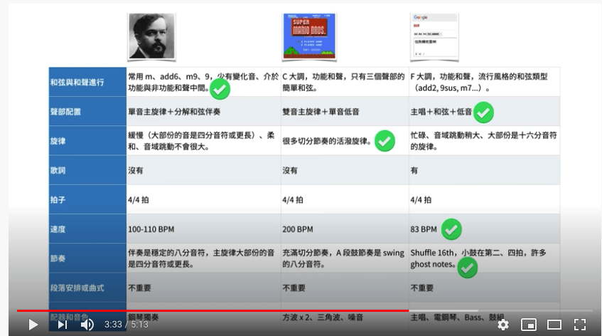
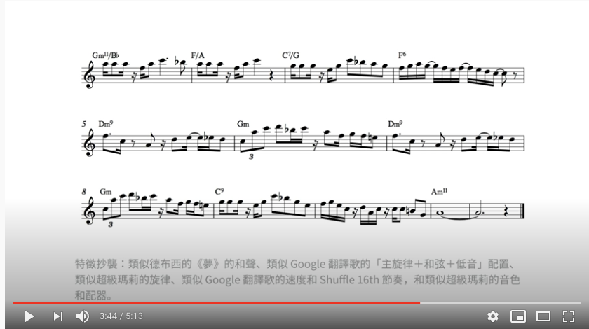

# REMIX 与借鉴

写到这里如果你还是没有灵感呢？没关系。我们还有最后的一个绝招，就是　-- COPY。

看到这个字，你一定会大惊失色。这不是一堂原创写作书吗？作者怎么会想要教我们抄袭。

是的。我没有要教你"抄袭"。所以本章才用一个比较中性的英文词 COPY。

### 这个世界其实大家都互相在 COPY

当你读了越多书，见识过更多领域。你会发现世界上其实没有什么新鲜事。只是不同的"套路"在不同的领域大量的重复。

有时候你可能发明一个东西，觉得自己是原创很兴奋。结果过了一两年。竟然会在另外一个领域，发现已经有人甚至早你几年，甚至早你几十年就发明了同样东西。

双方是在不同契机但相似同的条件下催化，所以最后有著类似的结果。

这本书前两章。眼尖的读者，其实可以发现，我来来去去谈的都是同一个话题：「结构」。

写作之所以困难。在于大家被一个「词」困住了。这个词，就是所谓的「灵感」。而最令人感到无奈气馁无解的事，就是基本上不管是网上什么写作课、写作书，只要谈到「激发灵感」这个章节，往往写的跟瑜珈书没两样。

这也是为什么在这本书里面，我用了大量的例子，为的是让大家看到：所谓灵感并不是"一团毛茸茸的能量球"，而是一个个棱角分明的结构。

事实上我们写作便秘的时候，并非是没有「灵感」，而是所谓「灵感」其实就是我们的一段散落记忆。写不出来是因为我们大脑没有使用过一个恰当的「结构」去将这个记忆好好的安放呈现。

### 同行的叫抄袭。但 COPY 异业的叫借鉴

以前曾经上过一堂商业文案课时，这堂课是练习写软文的。老师上课讲完了软文结构以后，给了我们一篇母婴电商软文、还有一篇瑜珈课程软文。然后要我们回去把这两篇文章改成自己领域的内容。只给我们1 个晚上的时间写。

这个作业超级神奇。隔天上课的同学，还真的魔改出了一篇超級銷售神文\...\...Orz

老师还给我们讲了个段子说：软文文案这东西根本没有原创，因为万用推坑框架就那几套。你只要注意，千万不要COPY 到同行的。COPY 到同行的叫抄袭。但 COPY 异业的叫借鉴。

### 你的创作是基于你过去人生体验的重新组合

我在音乐界也看到类似的例子。

知名音乐 youtuber 官为为在他的 Youtube 频道 NiceChord

好和弦当中一部作品「沒有靈感怎麼辦：「特徵清單」抄襲法」也谈到：

他更进一步的谈到，一首曲子可以分成以下结构：

 
所以如果作曲家灵感枯竭的话。可以怎么样激发灵感呢？

作曲家的作法可以试著去把完全不搭嘎的几首歌完全拆开。找寻可用的特征

最后再把这些特征 Remix 。也许就可以创作出一个全新旋律。

而这是抄袭吗？

wiwi 对于 COPY 这件事。他的看法是这样的：

> 我不晓得你在创作的时候会不会担心你正在做的东西不够原创，好像什么东西都有人做过了，这世界还有差我这个作品吗？我以前常常会这样子想，但是随着我越来越老，我就越能体会到太阳底下其实没有什么新鲜事，其实没有什么东西是原创的。你写的歌里面主旋律用的音阶不是你发明的，唱的歌词的文法也不是你制定的，使用的乐器也不是你自己制作的录音技巧，也不是只有你会毁音时的各种效果也不是你第一个用的

> 所以你现在创作的时候做的决定其实都是根基于所有在你之前的人类做的研究，以及你在这个世界上这段时间所有的人生体验的重新组合而已，根本没有什么东西是原创的，但这并不会让你的作品变得没有意义，因为还是只有你可以把你自己的人生经验用你自己的方式呈现出来。
