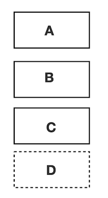

# 一次只写一个概念

还有一类同学的问题是觉得自己文章老是不受控制，老是写到跑偏，陷入改稿纠结。

这样的问题，我认为可以分成四种情况来讨论

1. 一次想写太多主题，连不起来或讲不出来
2. 题目与内容不合
3. 内容与原先结论不合
4. 文章段落之间接不起来

### TIPS 1: 一次只讲一个概念

新手写作最常犯的错，就是很常想在一篇文章里面讲多个概念。然后，然后就写不出来了。

其实这个问题不只是写作上会容易发生。在演讲上也容易发生。

我还记得大概五六年前时，那时候我的演讲其实很不轮转。我的演讲能力也是跟掷茭结果差不多。要马是福至心灵讲得很好。要不然就是讲得极为流畅，结结巴巴。为此，我感到很困扰。

因此，我在因缘际会下，去报名了谢文宪宪哥的“说出影响力”课程，想要改善这个状况。

宪哥听完我的演讲试讲以后，想了很久。他跟我说我的演讲风格很独特，他不想改我的演讲风格。不过他想要我记住一件事。就是尝试“一次只讲一个概念”。

我采用了这个指导建议，试著以后只要在我紧张时，一直想著这个原则。果然说话就流畅了，从此竟然就懂得演讲了。即便是要即席演讲，实在想不出来要讲什么。我只要记得“一次只讲一个概念”，即便这个即席演讲的概念只是「谢谢大会」，我的大脑也会有办法「自动」把后面的内容讲完（好像是自动导航一样）。

后来，我发现这个原则也适用于写作上。只要我遇到我因为一次想写太多东西导致无法下笔时，我就会想起这段往事。然后拿出一张纸，把想讲的概念关键字全部一口气写在白纸上。

然后圈出最重要的概念。然后下笔只谈这个概念。然后我的「灵感」莫名其妙就源源不觉，文章刷刷刷的自动写完了，很是神奇。

### TIPS 2: 写作时用「概念」取代标题

一般人还常犯的第二点问题是，先取「标题」。

各位不知道有没有发现一件事，在这本书里面，我们都始终还没有一个篇幅专门去谈「标题」这件事。为什么我们还没有谈这个主题呢？

其实这是因为「标题」的地位跟一本书的「前言」其实是差不多的，「标题」并不是一篇文章的「开头」，而是一篇文章的「结论」。

通常一篇好标题，几乎都是最后完稿时，由 5-10 个备选标题慢慢揣摩打磨而成的。所以太早定标题基本上是没有什么用的。因为你几乎不可能写出标题所要的感觉。

更准确的形容是，其实在一般人写文章时，是下意识按照著原先预先要取的「标题」里面暗藏的「概念」去写的。而这就会导致一种情况。有时候「自动导航」写到最后结果跟「标题」有可能有所偏差，甚至完全不一样。

所以这就造成了大家在写作上的很大困扰，觉得自己「写歪」了。

我以本书的上一章是「如何將文章寫的好看 -- 故事篇」作为举例好了。

这一篇，其实就是从我想写一个概念「文章 = Story + Lesson + Action」开始的。但是眼尖的读者，可能会发现，咦，不对阿。这句话不是藏在文章中间吗？

为什么这句话是藏在中间呢？

我的写作顺序是这样的：

感觉上这篇的标题应该是「如何写故事」，但是其实我是在传达「文章 = Story + Lesson + Action」这个概念。

这算离题吗？说算也不算。我其实是以「故事」的角度去包装「文章 = Story + Lesson + Action」好看这件事。

甚至，其实这篇文章也不算我的「自主意识」写的。而是我的「灵感」写的。

我只是设定了一个驾驶目标「文章 = Story + Lesson + Action」，接著就放开双手自动导航，等我回过神来，就已经莫名奇妙写了六千字的。超级神奇，哈哈哈哈。

各位在写作时，应该会发现所谓「写歪」这件事，跟开车很像。明明自己很想往左开，但行车电脑却乱开，自己老是想把方向盘抓回来，却发现自己开著开著撞山了。

是的。其实「写作」（又或者是所谓的表达）这件事，本身就是潜意识在主导。有可能你越想控制，就越开不到目的地，或开的七零八扭。

所谓的想一次表达太多，其实是行车电脑一次设定太多目的地，电脑算不出最佳路径，当机了。又或者文章写歪了，其实是目的地一开始就设定错了你不知道。所以才会觉得「电脑开歪了」，想抓回方向盘改回去。

所以，这就是为什么，写一篇文章时，尽量一次只讲一个概念，不要同时一口气想讲多个概念。

再来，尽量让你的灵感去自动导航自动撰写，而不要自己试图去抓方向盘。

为什么我们老是觉得自己写歪了呢？是因为有些时候，我们写作是有强目的性的。可能是要抢热点，或者是工作需要，必须在今天内写出这篇文章。所以对题目与结果设定的很硬。

所以自动导航下去，发现结果不是你想要的，所以就很心急。

有些人怕潜意识自动导航写不好。放心，大家的「潜意识」一定会开的比自己的自主意识好。你会写一大堆但是完全“离题”，那一定是潜意识里，觉得这件事才是对的，所以才会「离题」写了一大堆。

那我们可以怎么做，去修改最终结果呢？

#### 1. 换标题

像上一篇的文章「如何將文章寫的好看 -- 故事篇」。如果不是为了讲解需要，我才不会跟你说，原先的标题是「如何写故事」，副标题才是 "文章 = Story + Lesson + Action"。

我是回神以后才发现莫名其妙写了一篇好文章，干脆就直接把文章标题改了。

反正这样做也没人知道 XD

#### 2. 重写

「写作」这件事，本身其实也是回忆、学习、思考的一种形式。有时候不是自己把文章写偏，而是有些概念，不写下来连起来，自己才发现原来事情始末是这样连起来的。

像我自己有时候写文章时，常常是在「打个比方」阶段，透过跨界的模型比喻，才发现或想透公式原理。

有点是在这篇文章刚写下去，我本来以为这篇文章的结论可能是 A，结果写到最后，我才发现是 B。

当然，这样的文章扔掉很可惜。所以其实，你可以这样做。

再重写一篇 B 文章。围绕著 B 概念，再次把这件事讲清楚。

有些人可能很不喜欢重写这个概念。认为写一篇文章已经够花时间了。其实，如果你想通整个概念，写第二篇文章的速度产出的速度通常反而可能是第一篇文章的 1/3 时间以下。

### Tips 3 : 撰写概念的公式

这时候，可能读者又会想问。关于「写概念」这件事，有没有套路。真是有的。我可以拆解这个概念写作套路给大家看。

「如何將文章寫的好看 -- 故事篇」这篇文章用的就是这个结构。

我在写作时并不是刻意用这个结构去撰写文章，而是使用自动驾驶模式。专注围绕著「文章 = Story + Lesson + Action」这个概念讲述。只是回过神来，就自动形成了这样的结果。

这个框架本身就是人类自然的思考叙述架构的结果。并不算我发明的框架，只能顶多说是我发现了这个现象。

等等。这张图有点眼熟。

是的。这上面的每一个框的关键字，都是我们在第三章讲过的技巧

所以如果拆下去你真的还没有灵感的话，可以继续用六大写作模版继续循环下去。

### Tips 4 : 跳写

在写作过程中有时候我们会遇到这种情况

A 与 B 也写好了，知道自己等一下要写 C 与 D。但是莫名其妙的卡住，不知道 C 要怎么写。结果想来想去卡很久。C 就算写出来，也很尴尬。跟 D 串不起来。

这个 A,B,C,D 可以是段落、可以是句子。

我以前也深受其扰，而且常常因为这样写歪。后来我在写书过程改稿时，因为文章改多了，发现 C 要怎么处理。

结果是如果你遇到 C 写不出来。直接跳写。跳写有可能是你在原稿当中写一句分隔号「=====」，将 D 直接写出来后，继续往下写。正篇写完后，再去把 C 写完。

又或者是开大绝招，直接把 C 换成「小标题」。

是的，你没看错。就是换成小标题。我发现通常「自动导航」遇到 C 开不下去的原因，是因为潜意识里，可能 C 与 D 是一组的。与 A,B 并没有关系。所以怎么连就是连不起来。

但是因为写作的绝大多数时间，我们以为是自己在开车，遇到这一段路，就会想要强行开过去。

后来我发现其实如果写不下去。可以干脆不要写，甚至是强行在中间下标题或者是改成 1,2,3 归纳式写作。就可以完全闪避掉语气与思路完全无法连接下去的尴尬之处。

### Tips 5 : 以反问或第三角度代替结论

相同的情形，有时候也会发生在写结论的时候。

前面写的很 High，都把论点全部讲完了，结论完全不知道要写啥。

比如在「如何將文章寫的好看 -- 故事篇」一文章，其实整篇文章我都已经把「文章要好看 = 要在文章里面说故事」这个论点，这件事反覆的写了好几遍了。

如果我在结论时，再重提这件事，文风会变得「很尬」。而且关键是，结论说穿了就只有一句：「文章要好看 = 要在文章里面说故事」，硬要写真的很难掰出一大段，而且也会毁了整篇的文章的味道。

所以这时候可以怎么做呢？

我在朋友「李新」老师喜剧写作课时学到另外一个手法。叫换角度写作。

换角度写作是这样的。

* STEP1: 客观的叙述这件事
* STEP2: 用自己的角度去论述这件事
* STEP3: 用别人的角度再来看这件事

所以在结尾我不知道要怎么写下去的时候，我换了一个角度，以读者的角度去反问了一个问题：

「可以不写故事吗？」

其实这个段落也是重复了整个文章的观点，但是用反向叙述，就不会很尴尬，还可以按照这个视角补充新的论述。作为结尾尾声也不会让读者感到诧异。

所以各位读者，在写作尾声遇到撞墙时，不妨可以引入第三人视角，搞不会也能够产生出新的灵感。
